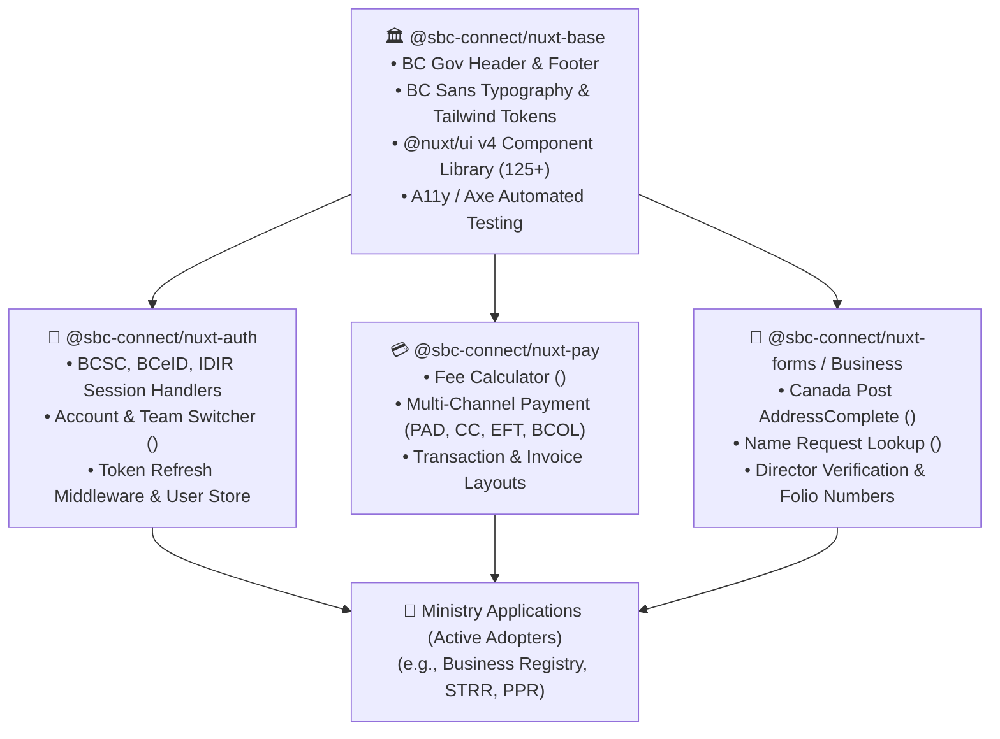

> **Accelerate frontend delivery across British Columbia digital services with a composable ecosystem of Nuxt layers, official BC Gov design tokens, 125+ accessible Nuxt UI components, and enterprise business widgets.**


---

## 🏗️ The Problem: Frontend Fragmentation

In traditional multi-team government organizations, every ministry and program area builds frontend applications in silos. This leads to common pitfalls:

* **Design Inconsistency:** Mismatched BC Gov headers, diverging color palettes, and inconsistent footer links across citizen portals.
* **Accessibility Debt:** Teams struggling to meet WCAG 2.1 AA requirements independently, resulting in inaccessible datepickers, modals without focus traps, and broken screen reader flows.
* **Reinventing the Wheel:** Re-coding Canada Post address lookups, re-implementing payment fee summary sidebars, and re-building OIDC session token refresh handlers for every single micro-service.
* **Maintenance Nightmare:** Applying a security patch or branding update requires dozens of pull requests across disparate repositories.

## 🎯 Value Proposition

* **Unified Provincial Identity:** Out-of-the-box BC Gov header, Crown logo, BC Sans typography, and WCAG AA accessible color palettes.
* **125+ Accessible UI Components:** Pre-integrated with **@nuxt/ui v4** and `@nuxt/a11y` automated Axe auditing to eliminate accessibility debt.
* **Plug-and-Play Business Primitives:** Instant access to Canada Post AddressComplete (`<ConnectAddress />`), Name Request lookups, and fee calculators (`<ConnectFeeWidget />`).
* **Multi-Identity Session Management:** Built-in BCSC, BCeID, and IDIR session lifecycles, token refresh handlers, and team switcher components.
* **Zero-Maintenance Upgrades:** Platform updates and security patches roll out seamlessly across applications via versioned Nuxt Layers (`extends: ['@sbc-connect/nuxt-base']`).



---

## 📦 The Connect-Nuxt Layer Ecosystem

Connect-Nuxt organizes capabilities into modular, independently versioned layers that can be stacked like building blocks:

---

### 1. Foundation Layer: `@sbc-connect/nuxt-base`
The foundational layer establishing the visual identity, accessible design system, and base layout primitives:

* **Official BC Government Identity:** Standardized header with Crown logo, service title, top-level navigation, and compliant footer links.
* **Design Tokens & Typography:** Native integration with **BC Sans** typography, official provincial color palettes (`#003366` Core Blue, `#FCBA19` Gold), and Tailwind CSS v4.
* **Accessibility by Default:** Pre-configured `@nuxt/a11y` integration with automated Axe auditing rules to enforce WCAG 2.1 AA standards across every build.
* **Bilingual Localization (i18n):** Native support for Canadian English (`en-CA`) and Canadian French (`fr-CA`) with shared dictionary keys.

---

### 2. Session & Identity Layer: `@sbc-connect/nuxt-auth`
Bridges client-side routing with the Connect Auth Service (`sbc-auth`):

* **Multi-IdP Session Lifecycle:** Automatic session establishment and token renewal for **BC Services Card (BCSC)**, **BCeID**, and **IDIR**.
* **Team Account Switcher (`<ConnectAccountSelector />`):** Dropdown component enabling users to toggle between multiple legal entity and team profiles with instant reactive state updates.
* **Authentication Route Guards:** Universal middleware (`auth.ts`) protecting authenticated routes and redirecting unauthorized visitors to provincial login ingress.
* **Reactive Auth Composables:** Direct access to `useConnectAuth()`, `useAccount()`, and `useUserProfile()`.

---

### 3. Financial & Fees Layer: `@sbc-connect/nuxt-pay`
Provides out-of-the-box payment integration with the Connect Pay Service:

* **Real-time Fee Widget (`<ConnectFeeWidget />`):** Sticky, responsive fee summary sidebar calculating statutory filing fees, priority processing charges, and PST/GST in real time as users configure filings.
* **Payment Method Selector:** Dynamic UI presenting the account's default payment method (Pre-Authorized Debit, stored Credit Card, Direct Pay, BC Online, or EFT).
* **Turnkey Checkout Layouts:** Pre-built page layouts (`ConnectPay.vue`, `ConnectPayTombstone.vue`) that handle invoice creation, payment status polling, receipt rendering, and error recovery.

---

### 4. Domain & Business Components: `@sbc-connect/nuxt-forms`
Reusable high-level business widgets required across provincial registries:

* **Canada Post AddressComplete (`<ConnectAddress />` / `<BcrosAddress />`):**
  * Typeahead address autocomplete powered by Canada Post AddressComplete API.
  * Automatic parsing of Unit/Suite, Street Number, Street Name, City, Province/State, and Postal Code.
  * Dual-mode support for Canadian domestic and International addresses.
  * Built-in Zod schema validation and error feedback.
* **Name Request Verification (`<ConnectNameRequest />`):**
  * Live status checking and verification of reserved BC Name Request (NR) numbers.
  * Conditional applicant consent validation and expiration tracking.
* **Director & Officer Verification:**
  * Standardized input cards for managing corporate directors, officers, and signing authorities.
* **Folio / Reference Number Input:**
  * Reusable client reference field used by law firms and accounting practices for billing reconciliation.

---

## 🎨 Powered by Nuxt UI Component Suite

All Connect-Nuxt layers build on top of **[Nuxt UI](https://ui.nuxt.com/docs/components)** (`@nuxt/ui` v4), providing a robust foundation of over **125+ accessible, battle-tested Vue components**:

| Category | Available Nuxt UI Components | BC Gov Customizations |
| :--- | :--- | :--- |
| **Form Inputs** | `UInput`, `UTextarea`, `USelect`, `USelectMenu`, `URadioGroup`, `UCheckbox`, `USwitch` | Pre-styled with high-contrast focus rings, clear error states, and ARIA described-by linkages. |
| **Navigation & Menus** | `UVerticalNavigation`, `UHorizontalNavigation`, `UDropdownMenu`, `UBreadcrumb`, `UPagination` | Standardized BC Gov brand links and responsive mobile drawer behaviors. |
| **Feedback & Overlays** | `UModal`, `USlideover`, `UPopover`, `UTooltip`, `UToast`, `UAlert` | Keyboard-trapped focus, accessible ESC dismissals, and high-visibility status icons. |
| **Data Display** | `UTable`, `UCard`, `UBadge`, `UAvatar`, `UAccordion`, `UKbd` | Responsive scroll containers, sortable columns, and accessible contrast ratios. |
| **Buttons & Triggers** | `UButton`, `UButtonGroup`, `UCommandPalette` | Gold primary buttons (`#FCBA19`), Blue secondary actions (`#003366`), and loading spinners. |

---

## 💻 Developer Quick-Start: Composing an App

Creating a brand-compliant, payment-ready BC Government application takes seconds with Nuxt Layer inheritance:

### 1. Configure Layers in `nuxt.config.ts`
```ts
// nuxt.config.ts
export default defineNuxtConfig({
  modules: [
    '@nuxt/ui',
    '@nuxt/content',
    '@nuxt/a11y'
  ],
  extends: [
    '@sbc-connect/nuxt-pay',
    '@sbc-connect/nuxt-forms',
    '@sbc-connect/nuxt-auth',
    '@sbc-connect/nuxt-base'
  ],
  compatibilityDate: '2026-05-01'
})
```

### 2. Use Layer Components Directly in Vue Pages
```vue
<template>
  <div class="max-w-4xl mx-auto py-8 space-y-6">
    <!-- Account Switcher from @sbc-connect/nuxt-auth -->
    <ConnectAccountSelector />

    <UCard>
      <template #header>
        <h2 class="text-xl font-bold text-bcgov-blue">Business Mailing Address</h2>
      </template>

      <!-- Canada Post Address Component from @sbc-connect/nuxt-forms -->
      <ConnectAddress
        v-model="businessAddress"
        :is-editing="true"
        schema="canada-post"
      />
    </UCard>

    <!-- Real-time Fee Widget from @sbc-connect/nuxt-pay -->
    <ConnectFeeWidget
      filing-code="BCINC"
      :quantity="1"
      :is-priority="isPriorityFiling"
    />

    <div class="flex justify-end gap-4">
      <UButton variant="outline" @click="handleCancel">Cancel</UButton>
      <UButton color="primary" @click="handleSubmit">Continue to Payment</UButton>
    </div>
  </div>
</template>

<script setup lang="ts">
const businessAddress = ref({})
const isPriorityFiling = ref(false)

const handleCancel = () => { /* ... */ }
const handleSubmit = () => { /* ... */ }
</script>
```

---

## ♿ Automated Accessibility & WCAG 2.1 AA Standards

Connect-Nuxt enforces strict compliance with provincial accessibility legislation:

* **Zero Axe Violations Guarantee:** Every component and layout in the layer repository is continuously audited via automated Playwright + `@axe-core/playwright` test suites in CI/CD.
* **Keyboard Navigability:** Full Tab, Shift+Tab, Space, Enter, and Arrow key navigation across all interactive widgets, dropdowns, and address autocomplete suggestions.
* **High Contrast Ratios:** Text, buttons, and form borders satisfy WCAG AAA and AA minimum contrast requirements against both light and dark backgrounds.
* **Screen Reader Optimization:** Semantic HTML5 elements (`<header>`, `<main>`, `<nav>`, `<footer>`) paired with live ARIA announcements (`aria-live`, `aria-busy`) for asynchronous payment calculations and address lookups.

---

## 📚 Training Materials & Official Documentation

* **[`connect-nuxt` Repository & Architecture Wiki](https://codewiki.google/github.com/bcgov/connect-nuxt):** Full layer specifications, composable references, and migration guides.
* **[Nuxt UI Component Documentation (ui.nuxt.com)](https://ui.nuxt.com/docs/components):** Interactive component playground, props, slots, and design guidelines for all 125+ UI primitives.
* **[Authentication & Team Account Management](/services/auth):** Deep-dive on how `@sbc-connect/nuxt-auth` handles federated accounts and B2B API keys.
* **[API Gateway (Apigee)](/services/apigee):** Review the edge gateway proxying requests sent by `@sbc-connect/nuxt-*` client plugins.
* **[Fine-Grained Authorization (OpenFGA)](/services/openfga):** Learn how frontend components perform client-side capability checks against OpenFGA.

---

## 🤝 Need Support?

* **Teams Channel:** Join `#connect-frontend` for Nuxt 4 layer support, component feature requests, and design system discussions.
* **Contribution Guide:** Propose new shared components or submit pull requests in the [`connect-nuxt`](https://codewiki.google/github.com/bcgov/connect-nuxt) monorepo.
