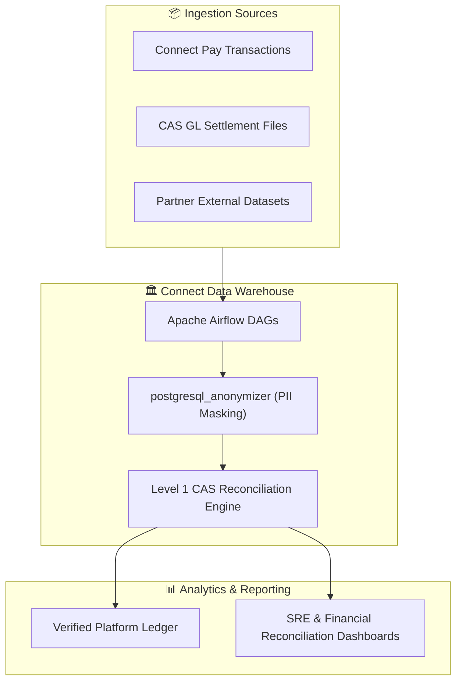
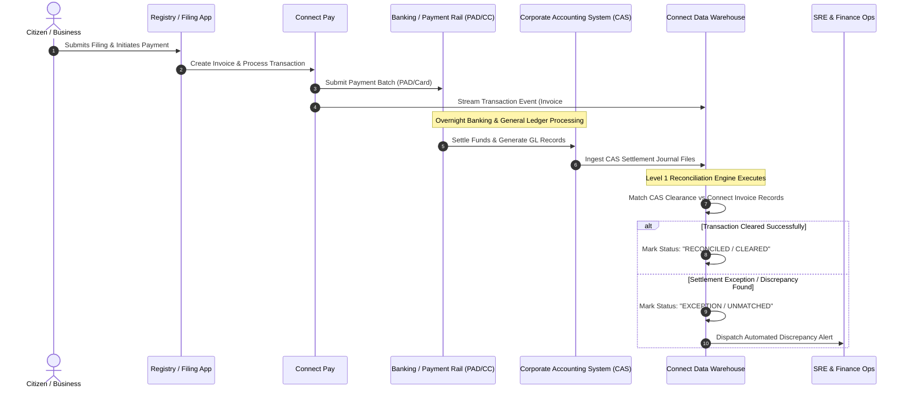
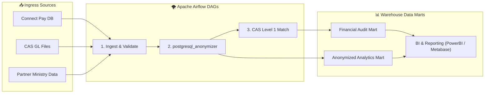
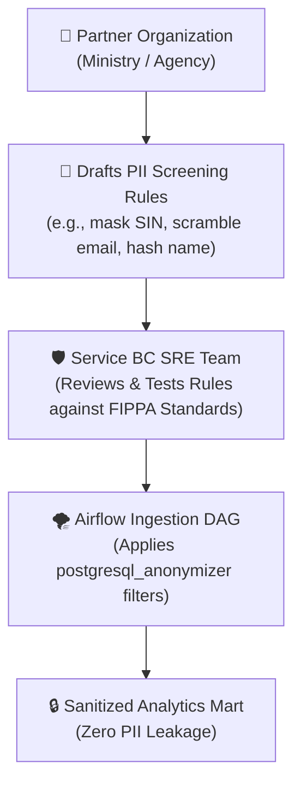

> **The single source of truth for platform transactions, Corporate Accounting System (CAS) financial reconciliation, automated Apache Airflow data pipelines, and privacy-first PII anonymization.**


---

## 🏛️ Overview & Purpose

The **Connect Data Warehouse** is the enterprise analytics and financial auditing backbone for Service BC and partner ministries. It aggregates millions of digital transactions across British Columbia registries, payment channels, and partner integrations into a unified, secure analytical repository.

## 🎯 Value Proposition

* **Centralized Platform Ledger:** Ingests every transaction, invoice, receipt, and fee assessment produced by Connect Pay and client applications (Business Registries, STRR, PPR).
* **Level 1 CAS Financial Reconciliation:** Matches provincial banking records from the **Corporate Accounting System (CAS)** against Connect payment transactions to verify actual settlement and clearance.
* **Automated Partner Data Orchestration:** Ingests external datasets on scheduled intervals managed by **Apache Airflow** Directed Acyclic Graphs (DAGs).
* **PII Screening & Anonymization:** Enforces data privacy and FIPPA compliance using **`postgresql_anonymizer`** rules provided by partners and validated by the SRE team.



---

## ⚖️ Level 1 Financial Reconciliation (CAS Clearance)

A core responsibility of the Data Warehouse is executing **Level 1 Financial Reconciliation**—answering the fundamental operational question: **"Did your transaction actually clear through the Corporate Accounting System (CAS)?"**



### Reconciliation Status Tiers

| Status | Description | Action Required |
| :--- | :--- | :--- |
| **Reconciled / Cleared** | Exact match between Connect Pay transaction and CAS general ledger settlement record (Invoice ID, amount, and account code match). | None. Recorded in permanent audit mart. |
| **In-Flight / Pending** | Transaction processed in Connect Pay within the last 24–48 hours; waiting for overnight CAS bank clearance batch. | Monitored automatically by next scheduled Airflow reconciliation run. |
| **Amount Discrepancy** | Transaction found in CAS, but settled amount differs from statutory filing fee (e.g. partial refund, chargeback, or bank fee deduction). | Flagged for automated finance team review. |
| **Unmatched Exception** | Connect Pay transaction has no corresponding CAS record after the expected settlement window (or vice versa). | Dispatches high-priority alert to Finance & SRE teams for investigation. |

---

## 🌪️ Data Pipeline Orchestration with Apache Airflow

All data ingestion, transformation, and reconciliation workflows in the Data Warehouse are orchestrated through **Apache Airflow**:



* **Scheduled DAGs:** Workflows execute on automated cadences (hourly, daily overnight, or monthly) depending on data source SLAs.
* **Idempotent Pipelines:** All Airflow tasks are built to be fully idempotent, allowing safe re-runs and historical backfills without duplicating transaction records.
* **Automated Retry & Alerting:** Transient database connection failures or delayed partner file drops trigger exponential backoff retries and Slack/PagerDuty notifications to SRE.

---

## 🛡️ Privacy & PII Screening: `postgresql_anonymizer`

To protect citizen and business privacy while enabling high-value reporting and cross-ministry data analytics, the Data Warehouse incorporates **`postgresql_anonymizer`** (`anon` extension).

### The Partner Screening Workflow

Partners providing external datasets to the Connect platform supply custom anonymization rules to the **SRE team**. These rules ensure that all confidential, proprietary, or Personally Identifiable Information (PII) is masked or scrambled before publication to shared analytics marts.



### Anonymization Strategies Supported

```sql
-- Example postgresql_anonymizer configuration rules
-- Applied during Airflow transformation phase

-- 1. Partial Masking of Identifiers
SECURITY LABEL FOR anon ON COLUMN partner_filings.sin_number
IS 'MASKED WITH FUNCTION anon.partial(sin_number, 0, "$$***-***-$$", 3)';

-- 2. Scrambling / Pseudonymizing Contact Information
SECURITY LABEL FOR anon ON COLUMN partner_filings.email_address
IS 'MASKED WITH FUNCTION anon.dummy_email()';

-- 3. Hashing / Salting Account References
SECURITY LABEL FOR anon ON COLUMN partner_filings.legal_name
IS 'MASKED WITH FUNCTION anon.pseudo_company(legal_name, ''sbc_salt_key'')';

-- 4. Generalizing Dates & Timestamps to Protect Anonymity
SECURITY LABEL FOR anon ON COLUMN partner_filings.birth_date
IS 'MASKED WITH FUNCTION anon.random_date_between(''1950-01-01'', ''2000-01-01'')';
```

---

## 📊 Data Marts & Analytical Consumption

The Data Warehouse structures information into specialized, access-controlled data marts:

1. **Financial Audit Mart:** Restricted to authorized Finance and SRE personnel; contains full audit trails, CAS clearance timestamps, ledger batch references, and fee breakdown line items.
2. **Anonymized Analytics Mart:** Open to product teams and policy analysts; contains sanitized transaction volumes, filing type distributions, regional geographic insights, and channel usage trends.
3. **Partner Ingestion Mart:** Dedicated schemas for cross-ministry data sharing, governed by partner-specific FOIPPA masking policies.

---

## 🤝 Partner Onboarding: Supplying Ingestion Rules

If your ministry or program area is onboarding data feeds to the Connect Data Warehouse:

1. **Define Schema & Ingress Cadence:** Document your table schemas, file formats (JSON, Parquet, CSV), and expected transfer schedules (e.g. daily at 02:00 PST).
2. **Specify PII Masking Rules:** Identify all PII and confidential fields. Specify the desired `postgresql_anonymizer` masking function (partial mask, dummy data, salted hash, or date generalization).
3. **Submit to SRE for Review:** Open an onboarding ticket with `#connect-sre` or submit your rule configuration to the [SRE Team](/sre).
4. **Airflow DAG Validation:** The SRE team deploys the ingestion DAG into `sandbox`/`dev` environments and runs synthetic data audits to confirm 0% PII leakage before promoting to `prod`.

---

## 📚 Related Documentation & Resources

* **[Connect Pay & Financial Fees Layer](/services/connect-nuxt#3-financial--fees-layer-sbc-connectnuxt-pay):** Learn how frontend components create payments recorded in the warehouse.
* **[Authentication & Team Account Management](/services/auth):** Discover how team IDs and account entities link to transaction ledgers.
* **[Site Reliability Engineering (SRE)](/sre):** Review operational monitoring, SLO tracking, and pipeline maintenance policies.
* **[API Gateway (Apigee)](/services/apigee):** Explore edge traffic routing for partner API feeds and warehouse export endpoints.
