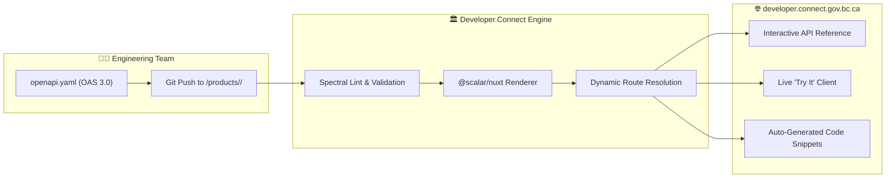

> **Publish OpenAPI contracts seamlessly through GitOps directories—automatically transformed into interactive, high-performance API references powered by Scalar on [developer.connect.gov.bc.ca](https://developer.connect.gov.bc.ca/en-CA/products).**


---

## 🚀 Overview & Capabilities

The **Developer OAS Registry** is the central catalog and documentation engine powering the public [Developer.Connect Portal](https://developer.connect.gov.bc.ca/en-CA/products). 

Instead of maintaining brittle documentation wikis or disparate PDF guides, product engineering teams publish standard **OpenAPI Specifications (OAS 3.0)** directly into their designated directories on the platform repository. The site automatically parses, validates, and renders these specifications using **[`@scalar/nuxt`](https://scalar.com)**—providing API consumers with modern, accessible, and interactive documentation.

## 🎯 Value Proposition

* **Zero-Friction Publishing:** Engineering teams simply commit their `openapi.yaml` or `openapi.json` file to their product folder; the platform handles build, routing, and deployment automatically.
* **Interactive "Try It" Sandbox:** API consumers can execute live requests against `api.connect.gov.bc.ca` directly from their browser, testing authentication headers, request payloads, and query parameters.
* **Multi-Language Code Generation:** Automatically generates ready-to-use SDK code snippets across multiple languages (TypeScript, Python, cURL, Go, Java, C#, PHP, Ruby).
* **OpenAPI 3.0 Compliant:** Standardized on OpenAPI 3.0 for seamless end-to-end compatibility across the Apigee Gateway, Spectral validation rules, and `@scalar/nuxt` rendering.



---

## ⚡ Powered by `@scalar/nuxt`

The Developer OAS Registry leverages **Scalar** (`@scalar/nuxt`), the next-generation API reference engine designed specifically for modern web frameworks:

### Key Scalar Capabilities in Connect

| Feature | Description | Developer Benefit |
| :--- | :--- | :--- |
| **Interactive "Try It" Console** | Built-in HTTP client with environment switcher (Sandbox, Test, Production). | Test endpoints immediately without opening Postman or writing boilerplate cURL scripts. |
| **Deep Schema Explorer** | Visual hierarchy of nested models, object structures, enums, regex patterns, and default values. | Instant clarity on required vs optional payload properties and validation constraints. |
| **Security Scheme Injection** | Native support for `ApiKeyAuth` (`x-apikey` header) and `BearerAuth` (OAuth2/OIDC JWTs). | Paste a B2B API Key or user token to authenticate test requests seamlessly. |
| **Instant Code Snippets** | Client snippets generated in 8+ programming languages with live parameter substitution. | Copy and paste working SDK code directly into ministry client codebases. |
| **Accessible & Fast** | Keyboard-navigable, high-contrast, WCAG 2.1 AA compliant, and sub-second rendering times. | Delivers a world-class developer experience across mobile and desktop viewports. |

---

## 📁 How Publishing Works (GitOps Workflow)

Publishing an API to the Developer.Connect catalog requires zero frontend coding:

### 1. Place the OAS Spec in Your Product Directory
Organize your API contract and introductory markdown inside `content/products/<product-slug>/`:

```text
developer-connect/
├── content/
│   └── en-CA/
│       └── products/
│           ├── bpc/                     # Business Platform Connect (BPC)
│           │   ├── index.md             # Product overview & guides
│           │   └── openapi.yaml         # Official OpenAPI 3.0 contract
│           ├── strr/                    # Short-Term Rental Registry
│           │   ├── index.md
│           │   └── openapi.yaml
│           ├── pay/                     # Connect Pay Engine
│           │   ├── index.md
│           │   └── openapi.yaml
│           └── ppr/                     # Personal Property Registry
│               ├── index.md
│               └── openapi.yaml
```

### 2. Configure Security & Servers in `openapi.yaml`
Ensure your specification defines official gateway servers and authentication schemes:

```yaml
openapi: 3.0.3
info:
  title: Business Platform Connect (BPC) API
  version: 1.0.0
  description: Public B2B API for business filings, lookups, and corporate registrations.
servers:
  - url: https://api.connect.gov.bc.ca/bpc/v1
    description: Production API Gateway
  - url: https://sandbox.api.connect.gov.bc.ca/bpc/v1
    description: Sandbox Environment (Free Testing)
components:
  securitySchemes:
    ApiKeyAuth:
      type: apiKey
      in: header
      name: x-apikey
      description: B2B Account API Key generated via Connect Auth
    BearerAuth:
      type: http
      scheme: bearer
      bearerFormat: JWT
security:
  - ApiKeyAuth: []
```

### 3. Automated CI/CD & Live Ingestion
When a pull request is submitted:
1. **Spectral Quality Gate:** CI executes [Spectral](https://stoplight.io/open-source/spectral) validation rules against all modified `openapi.yaml` files. Spec pull requests cannot merge if lint errors are present.
2. **Dynamic Ingestion & Deployment:** Upon merge to `main`, the `@scalar/nuxt` rendering engine registers the new product route and pre-renders the interactive documentation page at `https://developer.connect.gov.bc.ca/en-CA/products/<product-slug>`.

---

## 🔍 Automated Spec Linting with Spectral

To guarantee API consistency, prevent schema regressions, and protect `@scalar/nuxt` and Apigee from invalid contracts, the Developer OAS Registry enforces automated linting via **[Stoplight Spectral](https://stoplight.io/open-source/spectral)**.

### Standard Connect Ruleset (`.spectral.yaml`)

All product OpenAPI specifications must satisfy our shared Spectral ruleset extending standard OAS best practices:

```yaml
# .spectral.yaml
extends: ["spectral:oas"]

rules:
  # Enforce clear documentation standards
  operation-description: error
  operation-tags: error
  info-contact: warn
  info-description: error

  # Enforce standard HTTP error responses
  operation-4xx-response:
    description: All endpoints must define standard 4xx client error responses.
    message: "{{property}} must include at least one 4xx error code (e.g. 400, 401, 403, 404)."
    given: "$.paths.*[get,post,put,patch,delete].responses"
    then:
      field: "@key"
      match: "^4[0-9]{2}$"
    severity: error

  # Standardize server URLs targeting Apigee
  connect-gateway-servers:
    description: Server URLs must point to official Connect API Gateway environments.
    given: "$.servers[*].url"
    then:
      function: pattern
      functionOptions:
        match: "^https://(sandbox\\.)?api\\.connect\\.gov\\.bc\\.ca"
    severity: error
```

### Running Spectral Locally

Developers can lint their OpenAPI specification locally before pushing commits:

```bash
# Lint a specific product OAS specification
npx @stoplight/spectral-cli lint content/en-CA/products/bpc/openapi.yaml

# Lint all product specifications across the platform
npx @stoplight/spectral-cli lint "content/en-CA/products/**/openapi.yaml"
```

---

## 🔑 Integration with Apigee Gateway & B2B API Keys

The Developer OAS Registry is tightly coupled with our **[API Gateway (Apigee)](/services/apigee)** and **[Authentication & Team Accounts](/services/auth)**:

1. **Direct Gateway Routing:** Endpoints tested through the Scalar interface dispatch directly to `api.connect.gov.bc.ca`.
2. **B2B API Key Testing:** Developers can generate an `API_KEY` from their Team Account dashboard, paste it into Scalar's **Auth** field, and immediately execute requests settled against their account's default payment method.
3. **Decentralized Logging:** Calls made from the Scalar testing client flow through Apigee and are delivered into the product team's dedicated Cloud Logging sink for real-time observability.

---

## 📚 Related Documentation & Resources

* **[Explore Public API Products](https://developer.connect.gov.bc.ca/en-CA/products):** Browse all live OpenAPI contracts across Service BC.
* **[Stoplight Spectral Documentation (stoplight.io)](https://stoplight.io/open-source/spectral):** Official guide and ruleset reference for the Spectral JSON/YAML linter.
* **[Scalar Documentation (scalar.com)](https://scalar.com):** Learn more about the underlying `@scalar/nuxt` component library and customization options.
* **[API Gateway & Traffic Management (Apigee)](/services/apigee):** Explore edge routing, spike arrest, rate limiting, and decentralized logging.
* **[Authentication & Team Account Management](/services/auth):** Discover how B2B API keys are provisioned and translated into JWTs at the gateway.
* **[Connect-Nuxt Framework & Layers](/services/connect-nuxt):** Review shared Nuxt layers powering Connect client applications.
