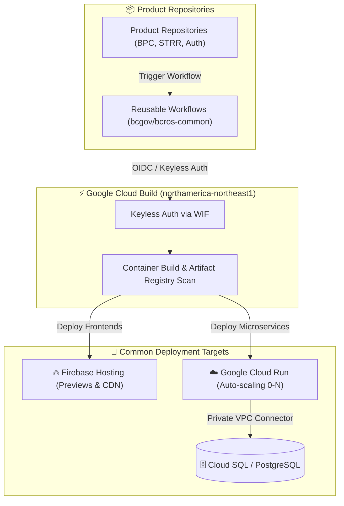
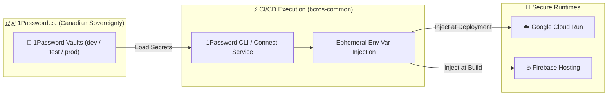
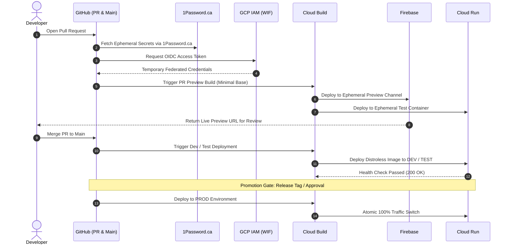

> **Reusable Continuous Deployment pipelines leveraging Google Cloud Build, 1Password.ca secrets, Google minimal base images, and shared GitHub Actions to deploy to Firebase and Google Cloud Run.**


---

The **Connect DevOps CD** platform provides centralized, secure, and production-tested Continuous Deployment pipelines that any product team across Service BC can leverage. By unifying our deployment architecture around **Google Cloud Build** and shared **GitHub Actions workflows** managed in [`bcgov/bcros-common`](https://github.com/bcgov/bcros-common/tree/main/.github/workflows), teams eliminate boilerplate CI/CD scripting, standardize security compliance, and achieve automated zero-downtime deployments to **Firebase** and **Google Cloud Run**.

---

## 🎯 Value Proposition

* **Zero Boilerplate Maintenance:** Product teams reference versioned, centralized workflows rather than maintaining bespoke shell scripts and brittle deployment actions.
* **Keyless Security via Workload Identity Federation (WIF):** No static service account keys or long-lived GCP credentials stored in GitHub Secrets.
* **Dual Standard Deployment Targets:** Native support for static/SSR frontends on **Firebase** and auto-scaling containerized microservices on **Google Cloud Run**.
* **Automated Pull Request Previews:** Ephemeral preview environments spun up on demand for every pull request to accelerate quality assurance and stakeholder sign-off.
* **Strict Multi-Stage Promotion:** Out-of-the-box support for gated promotions across `dev` ➔ `test` ➔ `prod` with environment approvals and one-click rollback capabilities.



---

## 🏗️ Architectural Pillars

### 1. Reusable GitHub Actions Workflows (`bcros-common`)
All common CD pipelines are developed and maintained in the open-source repository **[`bcgov/bcros-common/.github/workflows`](https://github.com/bcgov/bcros-common/tree/main/.github/workflows)**. These workflows encapsulate:
* Automated testing, linting, and [Spectral](https://stoplight.io/open-source/spectral) specification validation.
* Docker build optimizations and layer caching.
* Workload Identity Federation OIDC token exchanges.
* Environment promotion triggers and release tag creation.

### 2. Google Cloud Build Execution Engine
Builds execute within the Google Cloud network perimeter in the **`northamerica-northeast1` (Montreal)** region:
* **High-Throughput Concurrency:** Fast parallel builds powered by scalable Google Cloud Build worker pools.
* **Google Artifact Registry Integration:** Container images are automatically tagged with immutable Git commit SHAs, cached for fast rebuilds, and continuously scanned for CVE vulnerabilities.
* **Minimal Attack Surface:** Non-UI services are packaged using minimal, hardened base images to maintain an ultra-low vulnerability footprint.

---

## 🔒 Secrets Management via 1Password (`1Password.ca`)

All application secrets, database credentials, third-party API tokens, and signing certificates are strictly managed in **[1Password](https://1password.ca)**—hosted in Canada on **`1Password.ca`** by Canadian company 1Password, guaranteeing sovereign Canadian data residency.



### Key Principles of 1Password Integration:
* **Canadian Data Sovereignty:** Secrets reside exclusively on Canadian infrastructure under `1Password.ca` tenant vaults.
* **Zero Long-Lived Secrets in Repositories:** No plaintext secrets or static API tokens are committed to Git or stored in GitHub repository settings.
* **Automated Injection in Pipelines:** The common workflows retrieve required secrets at build and runtime using the 1Password CLI and official GitHub Actions (`1password/load-secrets-action`), injecting them directly into ephemeral deployment contexts.

---

## 🛡️ Minimal & Secure Container Images for Non-UI Services

For all **non-UI services**—including backend APIs, event processors, microservices, and asynchronous workers deployed to Cloud Run—the DevOps CD platform strictly mandates the use of **Google Cloud minimal and secure base images** (e.g. Google Distroless `gcr.io/distroless/*`).

### Why Minimal Distroless Images?
* **Zero Interactive Shells:** Base images contain no `/bin/sh`, `/bin/bash`, or terminal utilities, making remote command execution virtually impossible even if an application vulnerability occurs.
* **No Package Managers in Production:** `apt`, `apk`, and `yum` are stripped from runtime containers, preventing attackers from downloading malicious packages or tools.
* **Minimal CVE Attack Surface:** Shrinks container image size by up to 90% and eliminates extraneous operating system dependencies, reducing vulnerability scanner alerts in Google Artifact Registry.
* **Faster Cloud Run Cold Starts:** Compact, single-digit-megabyte runtime images pull and initialize significantly faster during rapid auto-scaling events.

### Recommended Multi-Stage Dockerfile Pattern

```dockerfile
# Stage 1: Build & Dependency Resolution
FROM node:20-alpine AS builder
WORKDIR /app
COPY package.json pnpm-lock.yaml ./
RUN npm install -g pnpm && pnpm install --frozen-lockfile
COPY . .
RUN pnpm build

# Stage 2: Minimal & Secure Production Runtime (Google Distroless)
# Contains only Node.js runtime and application code (no OS shell, no package manager)
FROM gcr.io/distroless/nodejs20-debian12:nonroot
WORKDIR /app
COPY --from=builder --chown=nonroot:nonroot /app/.output ./

USER nonroot
EXPOSE 8080
ENV PORT=8080 NODE_ENV=production

CMD ["server/index.mjs"]
```

---

## 🚀 Common Deployment Targets

The DevOps CD platform standardizes on two primary hosting targets depending on the nature of the application workload:

| Feature / Dimension | 🔥 Firebase (Hosting & App Hosting) | ☁️ Google Cloud Run |
| :--- | :--- | :--- |
| **Primary Workload** | Nuxt / Vue Web Clients, SPAs, Static Sites | Node.js, Python FastAPI/Flask, Go, Java APIs |
| **Base Image Strategy** | Static CDN Bundle & Managed SSR | Google Minimal & Distroless Base Images |
| **Architecture** | Global Edge CDN & Serverless SSR | Serverless Containerized Pods |
| **Scaling Characteristics** | Global edge distribution | Auto-scaling from 0 to N instances on demand |
| **Pull Request Previews** | Dedicated Firebase Preview Channels | Ephemeral Cloud Run Preview Services |
| **Database Access** | Public REST / GraphQL / Apigee Gateway | Direct Serverless VPC Access to Private Cloud SQL |
| **Deployment Strategy** | Atomic CDN cache invalidation | Blue/Green traffic splitting & instant revision rollback |

---

## 🔁 Multi-Stage Promotion Pipeline

DevOps CD enforces a reliable progression model across environments to ensure that all changes undergo rigorous automated verification:



---

## 💻 Quick-Start Adoption Guide

Adopting the common DevOps CD pipeline in any Service BC repository requires only a lightweight caller workflow in `.github/workflows/cd.yaml`.

### Example: Cloud Run Microservice Deployment

```yaml
name: Deploy Cloud Run Service

on:
  push:
    branches: [ main ]
    tags: [ 'v*.*.*' ]

jobs:
  deploy:
    # Call the centralized, reusable workflow from bcros-common
    uses: bcgov/bcros-common/.github/workflows/cd-cloudrun.yaml@main
    with:
      service_name: 'bpc-api'
      region: 'northamerica-northeast1'
      environment: ${{ github.ref == 'refs/heads/main' && 'dev' || 'prod' }}
    secrets:
      onepassword_token: ${{ secrets.OP_CONNECT_TOKEN }}
      workload_identity_provider: ${{ secrets.GCP_WIF_PROVIDER }}
      service_account: ${{ secrets.GCP_WIF_SA }}
```

### Example: Firebase Frontend Deployment

```yaml
name: Deploy Firebase Frontend

on:
  pull_request:
    branches: [ main ]
  push:
    branches: [ main ]

jobs:
  deploy:
    # Call the centralized Firebase workflow from bcros-common
    uses: bcgov/bcros-common/.github/workflows/cd-firebase.yaml@main
    with:
      project_id: 'service-bc-connect-dev'
      channel: ${{ github.event_name == 'pull_request' && 'preview' || 'live' }}
    secrets:
      onepassword_token: ${{ secrets.OP_CONNECT_TOKEN }}
      workload_identity_provider: ${{ secrets.GCP_WIF_PROVIDER }}
      service_account: ${{ secrets.GCP_WIF_SA }}
```

---

## 🛡️ Security, Observability & Rollback Strategy

* **Zero Static Secrets:** Authenticate via Workload Identity Federation and fetch runtime credentials dynamically from `1Password.ca` using short-lived tokens.
* **Instant Rollbacks:** In the event of an unexpected runtime failure, teams can instantly revert to previous known-good revisions via Cloud Run traffic management without triggering a full rebuild:
  ```bash
  # Instantly route 100% of production traffic to the previous healthy revision
  gcloud run services update-traffic bpc-api \
    --region=northamerica-northeast1 \
    --to-revisions=bpc-api-00042-xyz=100
  ```
* **Decentralized Cloud Logging:** Build and container runtime logs are routed to dedicated product-specific Cloud Logging sinks, giving development teams real-time visibility into deployments and service operations.

---

## 📚 Related Documentation & Resources

* **[bcgov/bcros-common Workflows Repository](https://github.com/bcgov/bcros-common/tree/main/.github/workflows):** Explore all available reusable workflows, action parameters, and templates.
* **[1Password.ca Security & Architecture](https://1password.ca):** Learn about Canadian data residency and 1Password Connect CLI integration.
* **[Google Distroless Images Repository](https://github.com/GoogleContainerTools/distroless):** Reference for minimal, secure, non-root base container images.
* **[Google Cloud Run Documentation](https://cloud.google.com/run/docs):** Official guide to container deployment, scaling, and VPC configuration.
* **[Firebase Hosting Documentation](https://firebase.google.com/docs/hosting):** Reference for preview channels, custom domains, and edge caching.
* **[API Gateway & Traffic Management (Apigee)](/services/apigee):** Learn how backend Cloud Run services are fronted by Apigee for rate limiting and routing.
* **[Connect-Nuxt Framework & Layers](/services/connect-nuxt):** Review our standardized Nuxt layers deployed to Firebase and Cloud Run.
* **[Developer OAS Registry](/services/developer-oas-registry):** Discover how API specifications are published and linted via Spectral in CI/CD.
