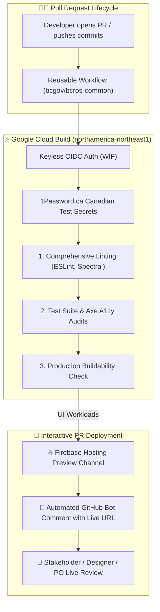
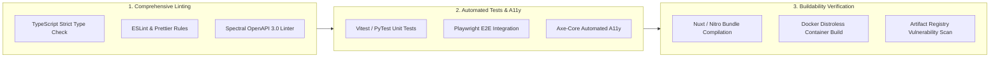

> **Enterprise-grade Continuous Integration pipeline chaining comprehensive linting, automated unit/E2E testing, buildability verification, and interactive PR-based Firebase preview deployments.**


---

The **Connect DevOps CI** platform provides a battle-tested, standardized Continuous Integration suite designed to accelerate development while guaranteeing zero regressions across all Service BC repositories. Built on top of **Google Cloud Build** and shared **GitHub Actions workflows** in [`bcgov/bcros-common`](https://github.com/bcgov/bcros-common/tree/main/.github/workflows), this pipeline chains comprehensive **linting**, **automated testing**, and **production buildability checks**—with live, interactive **PR-based preview deployments on Firebase Hosting** for UI services.

---

## 🎯 Value Proposition

* **Chained Multi-Stage Verification:** Ensures that code cannot merge unless it passes formatting, type checking, security linting, unit/E2E test suites, and production packaging.
* **Interactive PR-Based UI Deployments:** Automatically generates live, interactive **Firebase preview URLs** on every Pull Request so product owners, designers, and QA engineers can test changes directly in their browsers.
* **Zero Boilerplate Configuration:** Repositories invoke versioned shared workflows in `bcros-common` with under 15 lines of YAML.
* **High-Concurrency Google Cloud Build:** Parallelized execution on scalable GCP worker pools in `northamerica-northeast1` (Montreal) delivers sub-minute feedback loops to pull request authors.
* **Canadian Secrets Residency:** Test tokens and environment fixtures are securely loaded from Canadian infrastructure on **`1Password.ca`**.



---

## 🏗️ The 3 Core Verification Pillars

Every Pull Request undergoes a strict, automated 3-pillar quality check before it is eligible for review and merge:



### 1. Comprehensive Linting
* **Strict Type Safety:** Runs `vue-tsc` and `tsc --noEmit` to catch typing discrepancies and invalid prop bindings before runtime.
* **Code Quality & Style:** Enforces consistent formatting, import sorting, and anti-pattern detection via ESLint and Prettier.
* **API Contract Governance:** Executes **[Stoplight Spectral](https://stoplight.io/open-source/spectral)** on all modified OpenAPI specifications to guarantee valid operation IDs, descriptions, and error response schemas.

### 2. Automated Testing & Accessibility (A11y) Audits
* **Fast Unit Testing:** Runs Vitest (frontends) or PyTest (backend services) with code coverage assertions.
* **End-to-End User Flow Audits:** Executes Playwright browser tests covering critical citizen filing and payment paths.
* **Automated Accessibility Testing:** Injects Axe-Core into rendered Playwright pages to audit against WCAG 2.1 AA contrast, semantic HTML, ARIA landmarks, and keyboard focus compliance.

### 3. Production Buildability Verification
* **Bundle Compilation:** Executes full production builds (`pnpm build` / Nuxt Nitro SSR bundle generation) to verify that static assets, imports, and environment variable bindings compile cleanly.
* **Minimal Secure Container Images:** For non-UI microservices, validates that container images build successfully on Google minimal and distroless base images (`gcr.io/distroless/*`).

---

## 🌟 Interactive PR-Based Deployments (Firebase Hosting)

For UI applications and client dashboards (e.g. Business Registries, STRR, Connect Portal), the CI pipeline provides **PR-Based Preview Deployments** powered by **Firebase Hosting Preview Channels**.

### How PR Previews Work:
1. **Automated Trigger:** When a developer opens a Pull Request or pushes new commits, Cloud Build compiles the client frontend bundle.
2. **Ephemeral Channel Provisioning:** The assets are deployed to a dedicated, isolated preview channel on Firebase Hosting (e.g. `https://<project-id>--pr-142-xyz.web.app`).
3. **PR Comment Bot:** A GitHub Actions bot automatically posts (or updates) a comment on the Pull Request containing the live preview URL and expiration timestamp.
4. **Live Stakeholder Review:** Product Owners, UX designers, and external stakeholders can review the exact UI changes live without needing to clone the Git branch or run local dev tools.
5. **Automatic Cleanup:** Preview channels automatically expire and are purged after the Pull Request merges or closes, preventing residual costs and dangling environments.

---

## 💻 Quick-Start Adoption Guide

To enable common CI in any Service BC repository, add a lightweight workflow file in `.github/workflows/ci.yaml`.

### Example: Frontend Application with PR Previews

```yaml
name: Continuous Integration (UI + Previews)

on:
  pull_request:
    branches: [ main ]
  push:
    branches: [ main ]

jobs:
  ci:
    # Invoke the shared UI CI workflow from bcros-common
    uses: bcgov/bcros-common/.github/workflows/ci-ui.yaml@main
    with:
      project_id: 'service-bc-connect-dev'
      enable_firebase_preview: true
      node_version: '20'
    secrets:
      onepassword_token: ${{ secrets.OP_CONNECT_TOKEN }}
      workload_identity_provider: ${{ secrets.GCP_WIF_PROVIDER }}
      service_account: ${{ secrets.GCP_WIF_SA }}
```

### Example: Backend API Service CI

```yaml
name: Continuous Integration (Backend API)

on:
  pull_request:
    branches: [ main ]
  push:
    branches: [ main ]

jobs:
  ci:
    # Invoke the shared Backend CI workflow from bcros-common
    uses: bcgov/bcros-common/.github/workflows/ci-backend.yaml@main
    with:
      service_name: 'bpc-api'
      python_version: '3.11'
      enable_spectral_lint: true
    secrets:
      onepassword_token: ${{ secrets.OP_CONNECT_TOKEN }}
      workload_identity_provider: ${{ secrets.GCP_WIF_PROVIDER }}
      service_account: ${{ secrets.GCP_WIF_SA }}
```

---

## 🛡️ Security & Canadian Data Sovereignty

* **Keyless IAM Authentication:** CI runners authenticate with Google Cloud IAM via short-lived OIDC tokens using Workload Identity Federation (WIF). No long-lived service account keys are stored in GitHub Secrets.
* **1Password.ca Secret Management:** All test credentials, sandbox API keys, and test fixture accounts are fetched on demand from **`1Password.ca`** (Canadian data residency), guaranteeing that sensitive keys are never exposed in build logs or PR comments.
* **Distroless Non-UI Runtimes:** Container builds for backend APIs are verified against Google minimal distroless base images containing zero shells (`/bin/sh`) or package managers.

---

## 📚 Related Documentation & Resources

* **[bcgov/bcros-common Workflows Repository](https://github.com/bcgov/bcros-common/tree/main/.github/workflows):** Explore all reusable CI/CD workflows, parameters, and action definitions.
* **[DevOps CD (Common Continuous Deployment)](/services/devops-cd):** Learn about multi-stage promotions to Firebase and Google Cloud Run.
* **[Developer OAS Registry & Spectral](/services/developer-oas-registry):** Review OpenAPI 3.0 contract publishing and Spectral linting standards.
* **[Connect-Nuxt Framework & Layers](/services/connect-nuxt):** Discover shared Nuxt layers and component suites validated in CI.
* **[1Password.ca Security & Architecture](https://1password.ca):** Reference for Canadian data sovereignty and automated secret injection.
