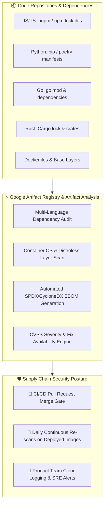
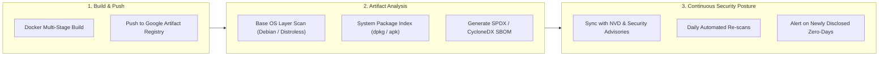

> **Continuous, automated vulnerability scanning for Docker container images in Google Artifact Registry and open-source software libraries across Python, JavaScript, TypeScript, Go, and Rust.**


---

The **Connect Security Scanning** platform provides continuous, automated vulnerability intelligence and supply chain security across every tier of modern application delivery. For partner teams and internal services storing container images in **[Google Artifact Registry](https://docs.cloud.google.com/artifact-registry/docs)** or maintaining software across **Python, JavaScript, TypeScript, Go, and Rust**, our security scanning framework leverages Google Cloud's **Artifact Analysis** and automated dependency scanners to offer turnkey protection against Common Vulnerabilities and Exposures (CVEs), supply chain poisoning, and stale dependency risks.

---

## 🎯 Value Proposition

* **Comprehensive Dual-Tier Protection:** Inspects both application-level third-party libraries (Python, Node/TS, Go, Rust) and system-level container base image layers (Debian, Alpine, Google Distroless).
* **Continuous Post-Deployment Monitoring:** Powered by **[Artifact Analysis](https://cloud.google.com/artifact-analysis/docs)**, Artifact Registry continuously re-scans active images against newly published CVEs in the National Vulnerability Database (NVD).
* **Automated Supply Chain Transparency (SBOM):** Automatically generates standard Software Bill of Materials (SPDX / CycloneDX) manifests for supply chain security, audit, and compliance readiness.
* **Non-Blocking Developer Guidance:** Actionable remediation advisories and patch upgrade paths are delivered directly in pull request checks, minimizing developer friction while enforcing high security standards.



---

## 📚 Multi-Language Library Scanning Matrix

Our shared CI workflows provide native dependency auditing across all languages officially supported on the Connect platform:

| Language / Ecosystem | Primary Manifests | Scanner Engine | Vulnerability Database / Feed |
| :--- | :--- | :--- | :--- |
| **JavaScript / TypeScript** | `pnpm-lock.yaml`, `package-lock.json` | `pnpm audit`, `npm audit`, OSV-Scanner | GitHub Advisory Database & OSV |
| **Python** | `requirements.txt`, `poetry.lock`, `Pipfile.lock` | `pip-audit`, PyPI Safety | PyPA Advisory Database & OSV |
| **Go** | `go.mod`, `go.sum` | `govulncheck` | Official Go Vulnerability Database (`vuln.go.dev`) |
| **Rust** | `Cargo.lock`, `Cargo.toml` | `cargo-audit` | RustSec Advisory Database |

### Language-Specific Capabilities:
1. **JavaScript & TypeScript (`pnpm audit` / `npm audit`):**
   * Inspects entire transitive dependency trees for prototype pollution, arbitrary code execution, and denial-of-service vulnerabilities.
   * Enforces semantic patch upgrade recommendations without breaking production peer dependencies.
2. **Python (`pip-audit`):**
   * Scans both compiled binary wheels and source distributions against the Python Packaging Advisory Database.
   * Detects unpinned dependencies and deprecated sub-packages.
3. **Go (`govulncheck`):**
   * Leverages static call-graph analysis to report only vulnerabilities in functions that your application code **actually calls**, eliminating 95% of dependency alert noise.
4. **Rust (`cargo-audit`):**
   * Audits `Cargo.lock` against memory safety issues, unsound unsafe blocks, and abandoned crates reported in RustSec.

---

## 🐳 Google Artifact Registry & Artifact Analysis

For all containerized workloads deployed to **Google Cloud Run** or **GKE**, the platform integrates natively with **[Google Artifact Registry](https://docs.cloud.google.com/artifact-registry/docs)** and **[Artifact Analysis](https://cloud.google.com/artifact-analysis/docs)** in **`northamerica-northeast1` (Montreal)**:



### Key Capabilities of Artifact Analysis:
* **On-Push Automated Inspection:** The instant a Docker image is pushed to Artifact Registry, an on-demand scan indexes all OS packages, installed binaries, and language runtimes.
* **Daily Continuous Re-scanning:** As new CVEs are registered in national vulnerability databases, Artifact Analysis automatically re-evaluates all stored and deployed container tags without requiring a re-push or rebuild.
* **Supply Chain Security & Provenance:** Stores immutable vulnerability metadata, SLSA provenance records, and SBOM manifests directly alongside container images in Artifact Registry.
* **Minimal Distroless Layer Synergy:** By combining Artifact Registry scanning with **[Google Distroless base images](/services/devops-cd)** (which omit shells and package managers), teams achieve virtually zero container vulnerability alerts out of the box.

---

## 🔒 Supply Chain Security & SBOM Generation

Modern enterprise governance requires verifiable proof of software integrity at every stage of the software development lifecycle:

1. **Automated Software Bill of Materials (SBOM):** Generates standardized machine-readable manifests (SPDX 2.3 and CycloneDX) listing every open-source library, version, license, and dependency SHA.
2. **Immutable Digest Pinning:** All deployment pipelines resolve and pin container images by their unique cryptographic SHA256 digest (`image@sha256:...`) rather than mutable tags (e.g. `:latest`), preventing image tampering or unauthorized tag overwrites.
3. **Binary Authorization Readiness:** Integrates with policy enforcement engines to ensure that only container images verified and signed by Artifact Analysis with zero Critical CVEs can be deployed to production Cloud Run clusters.

---

## 💻 Quick-Start Adoption Guide

Partner teams can enable security scanning in their repositories using the reusable workflows in **[`bcgov/bcros-common/.github/workflows`](https://github.com/bcgov/bcros-common/tree/main/.github/workflows)**:

### Example: Automated Security Scan Workflow

```yaml
name: Security & Vulnerability Scanning

on:
  pull_request:
    branches: [ main ]
  schedule:
    # Run a daily scheduled scan at 03:00 UTC to catch newly disclosed CVEs
    - cron: '0 3 * * *'

jobs:
  security-scan:
    # Call the centralized security scanning workflow from bcros-common
    uses: bcgov/bcros-common/.github/workflows/security-scan.yaml@main
    with:
      scan_libraries: true
      scan_containers: true
      fail_on_critical: true
      languages: '["typescript", "python", "go"]'
    secrets:
      onepassword_token: ${{ secrets.OP_CONNECT_TOKEN }}
      workload_identity_provider: ${{ secrets.GCP_WIF_PROVIDER }}
      service_account: ${{ secrets.GCP_WIF_SA }}
```

---

## ⏱️ Remediation SLAs & Severity Thresholds

To maintain a secure platform posture, Connect teams and external partners adhere to standardized vulnerability response timelines:

| Severity Tier | CVSS Score Range | Description & Examples | Target Remediation SLA |
| :--- | :--- | :--- | :--- |
| **Critical** | 9.0 – 10.0 | Remote code execution, unauthenticated privilege escalation | **Within 48 hours** |
| **High** | 7.0 – 8.9 | SQL injection, authentication bypass, denial of service | **Within 14 calendar days** |
| **Medium** | 4.0 – 6.9 | Sensitive data exposure, cross-site scripting (XSS) | **Within 30 calendar days** |
| **Low** | 0.1 – 3.9 | Minor information leakage, low-impact theoretical flaws | **Next scheduled maintenance** |

---

## 📚 Related Documentation & Resources

* **[Google Artifact Registry Documentation](https://docs.cloud.google.com/artifact-registry/docs):** Official guide to artifact management, repositories, and permissions in GCP.
* **[Google Artifact Analysis & Supply Chain Security](https://cloud.google.com/artifact-analysis/docs):** Deep-dive into automated vulnerability scanning, SBOMs, and metadata storage.
* **[bcgov/bcros-common Workflows](https://github.com/bcgov/bcros-common/tree/main/.github/workflows):** Reusable security scanning and deployment GitHub Actions.
* **[DevOps CI (Continuous Integration)](/services/devops-ci):** Learn how security audits are chained with unit and E2E testing in CI.
* **[DevOps CD (Continuous Deployment)](/services/devops-cd):** Review minimal Distroless container standards and 1Password.ca secrets management.
* **[Go Vulnerability Management](https://go.dev/doc/security/vuln):** Reference for `govulncheck` and call-graph security analysis.
* **[RustSec Advisory Database](https://rustsec.org):** Security advisories and `cargo-audit` tool documentation.
