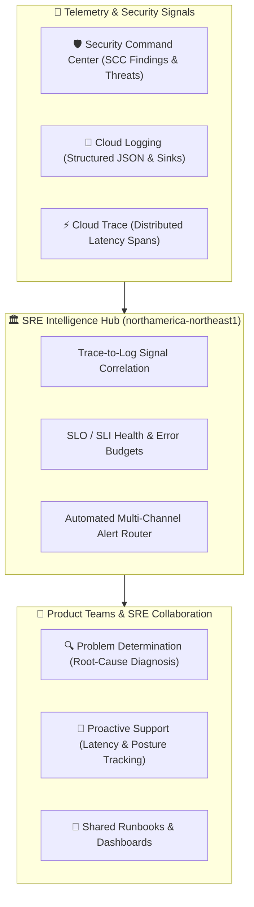

> **Unified operational telemetry and threat intelligence platform connecting Security Command Center, Cloud Logging, and Cloud Trace to empower SRE and product teams with proactive support and sub-second problem determination.**


---

The **Connect DevOps Observability** platform unifies telemetry, distributed performance tracing, and enterprise threat intelligence into a shared operational backbone. Operated by the **Site Reliability Engineering (SRE) team** in active partnership with product engineering teams (such as Business Registries, STRR, Pay, and Auth), this service transforms raw telemetry into actionable insights—accelerating **problem determination**, enabling **proactive support**, and ensuring continuous security compliance across British Columbia's digital infrastructure.

---

## 🎯 Value Proposition

* **Unified Telemetry Triad:** Seamlessly connects **Security Command Center (SCC)**, **Cloud Logging**, and **Cloud Trace** to provide 360-degree visibility from the network edge to the database.
* **Rapid Problem Determination:** Correlates distributed trace spans directly to structured error log lines via unified `trace_id` and `span_id` headers, reducing Mean Time to Resolution (MTTR) from hours to minutes.
* **Proactive SRE & Partner Support:** Tracks Service Level Objectives (SLOs) and error budget burn rates to catch performance degradation, memory leaks, and downstream latency regressions *before* citizens experience service disruptions.
* **Decentralized Product Team Ownership:** Product teams gain native access to their service-scoped logs, traces, and security findings in Google Cloud Console without requiring global platform administrative privileges.
* **Continuous Security & Threat Posture:** Real-time threat detection and security posture monitoring powered by Google Cloud Security Command Center in `northamerica-northeast1`.



---

## 🏗️ The 3 Observability Pillars

```mermaid
flowchart LR
  subgraph P1 ["1. Security Command Center"]
    SCC1["Vulnerability & Threat Detection"]
    SCC2["IAM Misconfiguration Audits"]
    SCC3["Compliance & Security Posture"]
  end

  subgraph P2 ["2. Cloud Logging"]
    Log1["Structured JSON Payloads"]
    Log2["Decentralized Project Log Sinks"]
    Log3["Log-Based Metrics & Error Alerts"]
  end

  subgraph P3 ["3. Cloud Trace (OTel)"]
    Tr1["Distributed Request Propagation"]
    Tr2["Apigee ➔ Cloud Run ➔ Cloud SQL"]
    Tr3["Latency Bottleneck Waterfalls"]
  end

  P1 --> P2
  P2 --> P3
```



### 1. Security Command Center (SCC)
Google Cloud Security Command Center provides centralized threat intelligence, vulnerability assessment, and security posture monitoring:
* **Vulnerability & Threat Detection:** Scans running infrastructure, container runtime behaviors, and ingress policies for active anomalies, cryptomining indicators, and potential data exfiltration attempts.
* **IAM & Infrastructure Misconfigurations:** Continuously evaluates cloud IAM bindings, service account keys, and VPC firewall rules against provincial compliance standards.
* **Shared Security Intelligence:** SRE triages high-severity findings and dispatches actionable remediation playbooks directly to product development teams.

### 2. Cloud Logging & Decentralized Sinks
Cloud Logging collects, indexes, and routes structured logs from all platform workloads:
* **Decentralized Product-Scoped Log Sinks:** Utilizing **[Apigee MessageLogging policies](/services/apigee#separated-telemetry--cloud-logging-access)** and Google Cloud Log Routers, request logs are routed into dedicated GCP project log sinks. Product engineers inspect their own logs in **Google Cloud Logs Explorer** with full autonomy.
* **Structured JSON Logging:** All services emit structured JSON logs containing timestamp, severity, HTTP request metadata, exception stack traces, and correlation tokens.
* **Log-Based Metrics:** SRE and product teams define automated metrics derived from log filters (e.g. tracking HTTP 500 error spikes, payment gateway timeouts, or specific error codes).

### 3. Cloud Tracing & Distributed Latency Analysis
Cloud Trace captures end-to-end distributed transaction waterfalls across multi-tier microservices:
* **End-to-End Distributed Tracing:** Follows user requests as they traverse **Apigee API Gateway** ➔ **Cloud Run Services** (Auth, Pay, Registries) ➔ **Cloud SQL / PostgreSQL** and external payment gateways.
* **Latency Bottleneck Pinpointing:** Trace waterfall diagrams clearly isolate whether latency spikes stem from database lock contention, cold starts, or third-party webhooks.
* **OpenTelemetry Standard:** Instrument applications using vendor-neutral **[OpenTelemetry (OTel)](https://opentelemetry.io)** SDKs for transparent tracing across TypeScript, Python, and Go.

---

## 🤝 SRE & Product Team Partnership Model

Observability is not just a toolset—it is an active collaborative workflow between SRE and product teams:

| Operational Area | SRE Role | Product Team Role | Value Delivered |
| :--- | :--- | :--- | :--- |
| **Problem Determination** | Correlates cross-service trace spans and network edge logs during major incidents. | Inspects internal application exceptions and business logic flows in product log sinks. | **Sub-minute root cause diagnosis** with zero blind spots. |
| **Proactive Support** | Configures automated SLO burn-rate alerts and anomalous latency detectors. | Tunes database queries and optimizes API payloads before error thresholds breach. | **Zero citizen disruption;** issues are resolved before user impact. |
| **Security Posture** | Monitors enterprise-wide SCC dashboards and orchestrates vulnerability response. | Applies library and container base image patches according to [remediation SLAs](/services/devops-image-library-scanning#remediation-slas--severity-thresholds). | **Ironclad provincial compliance** and continuous audit readiness. |
| **Shared Runbooks** | Maintains platform-level incident runbooks and automated rollback procedures. | Documents service-specific error codes, recovery playbooks, and dependency graphs. | **Consistent, stress-free incident management** during on-call rotations. |

---

## 💻 Quick-Start Instrumentation Guide

To ensure end-to-end trace correlation and structured logging, microservices adhere to standard logging conventions:

### Example: Python (FastAPI / Cloud Run) Structured Logging & Tracing

```python
import logging
from google.cloud import logging as gcp_logging
from opentelemetry import trace

# Initialize GCP Logging Client
client = gcp_logging.Client()
client.setup_logging()

logger = logging.getLogger("bpc_service")
tracer = trace.get_tracer(__name__)

def process_filing(filing_id: str, account_id: str):
    with tracer.start_as_current_span("process_filing") as span:
        # Trace span automatically captures latency
        span.set_attribute("filing.id", filing_id)
        span.set_attribute("account.id", account_id)
        
        logger.info(
            "Processing business filing",
            extra={
                "json_fields": {
                    "filing_id": filing_id,
                    "account_id": account_id,
                    "service": "bpc-api"
                }
            }
        )
```

### Example: TypeScript / Nuxt Structured Log Output

```typescript
// Shared Nuxt / Nitro structured log emission
export default defineEventHandler(async (event) => {
  const traceHeader = getHeader(event, 'x-cloud-trace-context')
  const traceId = traceHeader ? traceHeader.split('/')[0] : 'unknown'

  console.log(JSON.stringify({
    severity: 'INFO',
    message: 'Processed citizen payment confirmation',
    trace: `projects/${process.env.GCP_PROJECT_ID}/traces/${traceId}`,
    path: event.path,
    method: event.method,
    timestamp: new Date().toISOString()
  }))
})
```

---

## 📚 Related Documentation & Resources

* **[Google Cloud Logging Documentation](https://cloud.google.com/logging/docs):** Official guide to log routing, sinks, and Logs Explorer queries.
* **[Google Cloud Trace Documentation](https://cloud.google.com/trace/docs):** Distributed tracing, waterfall visualization, and latency analysis.
* **[Security Command Center Overview](https://cloud.google.com/security-command-center/docs):** Enterprise threat detection and security posture management.
* **[Apigee API Gateway & Log Sinks](/services/apigee#separated-telemetry--cloud-logging-access):** Learn how Apigee routes logs to decentralized product sinks.
* **[DevOps Security Scanning](/services/devops-image-library-scanning):** Review container image vulnerability analysis and Artifact Analysis integration.
* **[OpenTelemetry Documentation](https://opentelemetry.io/docs/):** Vendor-neutral instrumentation standard for traces and metrics.
