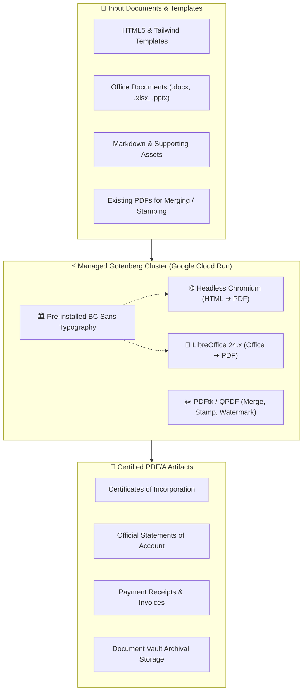
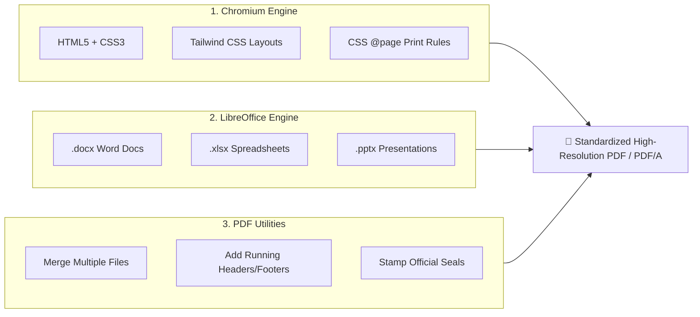

> **High-speed, centralized document rendering engine powered by Gotenberg. Convert HTML templates, Markdown, and Office documents into certified PDF/A records with pre-installed BC Sans typography.**


---

The **Connect Document Creation** service provides a managed, high-speed document rendering engine powered by **[Gotenberg](https://gotenberg.dev/)**. Pre-configured with official **BC Government standard fonts (BC Sans)**, this centralized platform service converts HTML templates, Markdown, and Office documents into certified, archival-grade PDFs—eliminating the need for individual product teams to maintain heavy headless browser dependencies or complex conversion runtimes.

---

## 🎯 Value Proposition

* **Pre-Baked Provincial Typography (BC Sans):** The full **BC Sans** font family (Regular, Bold, Italic, Bold-Italic) is pre-installed in the container runtime, guaranteeing pixel-perfect government branding with zero font substitution or layout jitter.
* **Zero Microservice Bloat:** Product teams make simple REST API calls rather than bundling 500MB+ Chromium, LibreOffice, or wkhtmltopdf binaries inside their own application containers.
* **Multi-Format Ingestion:** Seamlessly converts HTML5/Tailwind templates, Markdown files, and Microsoft Office documents (`.docx`, `.xlsx`, `.pptx`) into standardized PDF and PDF/A outputs.
* **Advanced PDF Manipulation:** Merge multiple dynamic documents, append external schedule attachments, stamp official provincial seals, apply "DRAFT" watermarks, and calculate dynamic page counts (`Page X of Y`).
* **Enterprise Scalability & Resilience:** Deployed on **Google Cloud Run** in `northamerica-northeast1` (Montreal), auto-scaling from 0 to N instances with sub-second generation latency and protected by the **Apigee API Gateway**.



---

## 🏛️ Pre-Installed BC Government Standard Fonts

One of the most common pitfalls in distributed document generation is **font substitution**—where missing server-side fonts cause misaligned text, unexpected line wraps, and broken layout margins.

The Connect Document Creation service resolves this by baking the complete provincial typography suite directly into the base container image:

| Font Family | Variants Included | Usage & Standards |
| :--- | :--- | :--- |
| **BC Sans** | `Regular`, `Bold`, `Italic`, `Bold-Italic` | Primary provincial typeface for headings, body copy, and tabular filing data. |
| **BC Sans Condensed** | `Regular`, `Bold` | Compact summary tables, multi-column statements, and legal fee schedules. |
| **Noto Sans / Symbols** | `Regular`, `Bold` | International unicode glyph support, currency symbols, and checkmark iconography. |
| **Liberation Sans / Serif** | Metric-compatible standard | Fallback compatibility for Microsoft Office (`Arial`, `Times New Roman`) document conversions. |

---

## ⚙️ Core Conversion Capabilities



### 1. HTML5 to PDF (Headless Chromium)
The preferred approach for modern dynamic documents. Provide an `index.html` file along with external CSS, images, and fonts:
* Supports full modern web layout standards: **Flexbox**, **CSS Grid**, and **Tailwind CSS**.
* Precise print control using CSS `@page` rules (margins, page size `A4`/`Letter`, portrait/landscape orientation).
* Separate HTML templates for repeating headers and footers with dynamic placeholders: `{{pageNumber}}`, `{{totalPages}}`, and `{{date}}`.

### 2. Office Documents to PDF (LibreOffice)
Enables non-technical administrative teams to design document templates in Microsoft Word or Excel:
* Directly converts `.docx`, `.xlsx`, `.pptx`, `.odt`, and `.rtf` files into crisp, readable PDFs.
* Retains tables, charts, embedded shapes, and corporate letterhead formatting.

### 3. PDF Merging, Stamping & Watermarking
* **Stitching & Merging:** Combine a freshly generated filing summary PDF with multiple user-uploaded PDF schedules into a single certified package.
* **Watermarks & Stamps:** Apply transparent "DRAFT", "CONFIDENTIAL", or "CERTIFIED COPY" watermark overlays across all pages.
* **Archival Compliance (PDF/A):** Produce PDF/A-1b and PDF/A-2b compliant documents suitable for permanent provincial digital archives.

---

## 💻 Quick-Start Integration Guide

Product microservices access the service via the **Apigee API Gateway** at `https://api.connect.gov.bc.ca/doc/api/v1`.

### Example 1: Generate PDF from HTML (cURL)

```bash
curl --request POST 'https://api.connect.gov.bc.ca/doc/api/v1/forms/chromium/convert/html' \
  --header 'x-apikey: YOUR_API_KEY' \
  --form 'files=@index.html' \
  --form 'files=@header.html' \
  --form 'files=@footer.html' \
  --form 'marginTop=0.5' \
  --form 'marginBottom=0.5' \
  --form 'marginLeft=0.5' \
  --form 'marginRight=0.5' \
  --output certificate.pdf
```

### Example 2: TypeScript / Nuxt Server Route

```typescript
// server/api/documents/generate-certificate.post.ts
export default defineEventHandler(async (event) => {
  const { businessName, incorporationNumber, issueDate } = await readBody(event)

  // 1. Compose HTML with native BC Sans font styling
  const htmlContent = `
    <!DOCTYPE html>
    <html>
      <head>
        <meta charset="utf-8" />
        <style>
          body { font-family: 'BC Sans', sans-serif; padding: 40px; color: #003366; }
          h1 { font-size: 28px; border-bottom: 2px solid #FCBA19; padding-bottom: 8px; }
          .meta { font-size: 14px; margin-top: 20px; }
        </style>
      </head>
      <body>
        <h1>Certificate of Incorporation</h1>
        <p>This is to certify that <strong>${businessName}</strong> was incorporated on ${issueDate}.</p>
        <div class="meta">Incorporation Number: <strong>${incorporationNumber}</strong></div>
      </body>
    </html>
  `

  const formData = new FormData()
  formData.append('files', new Blob([htmlContent], { type: 'text/html' }), 'index.html')

  // 2. Call the Managed Gotenberg Service
  const pdfResponse = await $fetch.raw('https://api.connect.gov.bc.ca/doc/api/v1/forms/chromium/convert/html', {
    method: 'POST',
    headers: {
      'x-apikey': process.env.CONNECT_DOC_API_KEY!
    },
    body: formData
  })

  // 3. Return the generated binary PDF stream
  setHeader(event, 'Content-Type', 'application/pdf')
  setHeader(event, 'Content-Disposition', 'attachment; filename="certificate.pdf"')
  return pdfResponse._data
})
```

### Example 3: Python (FastAPI / Requests)

```python
import requests

def generate_invoice_pdf(invoice_html: str, api_key: str) -> bytes:
    url = "https://api.connect.gov.bc.ca/doc/api/v1/forms/chromium/convert/html"
    headers = {"x-apikey": api_key}
    
    files = {
        "files": ("index.html", invoice_html, "text/html")
    }
    data = {
        "paperWidth": "8.5",
        "paperHeight": "11",
        "marginTop": "0.4",
        "marginBottom": "0.4"
    }

    response = requests.post(url, headers=headers, files=files, data=data)
    response.raise_for_status()
    return response.content
```

---

## 📚 Related Documentation & Resources

* **[Gotenberg Official Documentation](https://gotenberg.dev/):** Complete API reference for Chromium, LibreOffice, PDFtk, and Markdown conversion endpoints.
* **[BC Government Typography Guide](https://www2.gov.bc.ca/gov/content/governments/services-for-government/policies-procedures/bc-visual-identity/visual-elements/typography):** Official standards and specifications for the **BC Sans** typeface.
* **[Connect-Nuxt Framework](/services/connect-nuxt):** Reusable Vue/Nuxt UI layers for frontend document preview and download components.
* **[Apigee API Gateway & Traffic Management](/services/apigee):** Understand API key authentication, rate limits, and routing to platform microservices.
