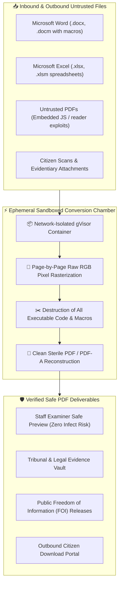
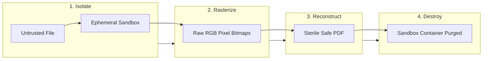

> **Zero-trust document disinfection service inspired by Dangerzone. Convert untrusted Word, Excel, PowerPoint, and PDF files into guaranteed clean, exploit-free PDFs using isolated ephemeral sandbox rasters.**


---

# Document Sanitization: Sandboxed Safe PDF Service

The **Connect Document Sanitization** service provides automated, zero-trust document disinfection inspired by the open-source **[Dangerzone](https://dangerzone.rocks/)** architecture developed by the Freedom of the Press Foundation. By isolating untrusted documents within disposable, sandboxed environments and converting every page into pure pixel rasters before rebuilding a clean PDF, this service guarantees that malicious macros, embedded JavaScript, tracking beacons, and zero-day PDF exploits are permanently neutralized.

This service protects both **inbound submissions** (e.g. citizen evidence uploads, tribunal exhibits, and partner filings) and **outbound distributions** (e.g. publicly downloadable records, FOI packages, and formal citizen correspondence).

---

## 🎯 Value Proposition

* **Zero-Trust Exploit Immunity:** Implements the battle-tested **Dangerzone pixel-isolation model**—untrusted documents are converted into raw RGB bitmaps inside an isolated sandbox, completely eliminating all embedded binary payloads, malicious VBA macros, and reader exploits.
* **Dual Inbound & Outbound Protection:** Shields internal government staff and registry examiners from infected citizen uploads while guaranteeing that outbound public downloads and legal disclosures are 100% clean and malware-free.
* **Multi-Format Disinfection:** Accepts Microsoft Word (`.docx`, `.doc`, `.docm`), Excel (`.xlsx`, `.xls`, `.xlsm`), PowerPoint (`.pptx`), PDFs (`.pdf`), EPUB, and untrusted image scans.
* **Fidelity & Searchability Preservation:** Reconstructs high-resolution visual documents with optional automated Optical Character Recognition (OCR) to maintain full text searchability and selection.
* **Ephemeral Stateless Cloud Run Isolation:** Executes inside hardened, network-isolated **gVisor sandboxes** on Google Cloud Run in `northamerica-northeast1` (Montreal), automatically destroying the conversion container immediately after file processing.



---

## 🔬 The Dangerzone Sandboxing Paradigm

Traditional antivirus scanners rely on known signature databases and heuristic analysis. However, targeted spear-phishing attacks, polymorphic macro scripts, and zero-day memory corruption bugs in PDF readers frequently bypass signature-based scanners.

The Connect Document Sanitization service operates on a **zero-trust mathematical certainty**:



1. **Strict Sandboxed Execution:** The untrusted document is opened inside an isolated, unprivileged container with zero access to the host filesystem, internal networks, or external internet.
2. **Conversion to Raw Pixels:** The document's visual pages are rendered directly into pure, uncompressed RGB/RGBA pixel rasters. During this process, all executable logic, VBA macros, DDE links, embedded scripts, and exploit payloads are permanently destroyed.
3. **Clean PDF Reconstruction:** A brand-new, sterile PDF is assembled using only the verified pixel bitmaps. An optional clean OCR text layer is generated to restore text searchability.
4. **Instant Disposal:** The sandbox container and all temporary raster buffers are immediately discarded from memory, preventing cross-contamination between requests.

---

## 🛡️ Inbound & Outbound Protection Scenarios

| Channel | Typical Use Cases | Threat Mitigated | Business Benefit |
| :--- | :--- | :--- | :--- |
| **Inbound Submissions** | • Citizen disputes & tribunal evidence<br>• Corporate filing attachments<br>• Vendor invoice submissions | Weaponized macros, malicious PDF scripts, credential-stealing exploits. | **Complete safety for provincial examiners;** staff can open and review public filings on internal workstations without risk. |
| **Outbound Distributions** | • FOI disclosure packages<br>• Publicly searchable corporate filings<br>• Email receipts and statements | Accidental data leakage, infected partner documents re-distributed to the public. | **Zero malware liability;** ensures British Columbia citizens and external legal counsel never receive compromised documents. |

---

## 💻 Integration Guide & API Specification

The sanitization and safe PDF conversion endpoint is available via the **Apigee Document Service Proxy** at the route `POST /doc/api/v1/pdf-conversions`.

### Request Specification (`POST /doc/api/v1/pdf-conversions`)

* **Endpoint:** `POST /doc/api/v1/pdf-conversions`
* **Headers:**
  * `Account-Id` *(required)*: The consumer account identifier associated with the request (e.g. `1234`).
  * `Content-Type` *(required)*: The MIME type of the uploaded source file. Supported formats include:
    * Documents: `application/pdf`, `application/msword` (`.doc`), `application/vnd.openxmlformats-officedocument.wordprocessingml.document` (`.docx`)
    * Spreadsheets: `application/vnd.ms-excel` (`.xls`), `application/vnd.openxmlformats-officedocument.spreadsheetml.sheet` (`.xlsx`), `text/csv`
    * Presentations: `application/vnd.ms-powerpoint` (`.ppt`), `application/vnd.openxmlformats-officedocument.presentationml.presentation` (`.pptx`)
    * Images & Text: `image/jpeg`, `image/png`, `image/tiff`, `image/gif`, `image/svg+xml`, `text/plain`
  * `x-apikey` *(required)*: Apigee Gateway API key authorized for `DocServiceProxy`.
* **Request Body:** Raw binary file payload (`format: binary`).
* **Response (`200 OK`):** Binary stream of the cleaned, safe PDF (`Content-Type: application/pdf`).

---

### Example 1: Sanitize Document via cURL

```bash
# Convert and sanitize an untrusted Word document to a sterile PDF
curl --request POST 'https://{gateway_host}/doc/api/v1/pdf-conversions' \
  --header 'x-apikey: YOUR_API_KEY' \
  --header 'Account-Id: 1234' \
  --header 'Content-Type: application/vnd.openxmlformats-officedocument.wordprocessingml.document' \
  --data-binary '@untrusted_submission.docx' \
  --output safe_document.pdf
```

### Example 2: TypeScript / Nuxt Server Route

```typescript
// server/api/documents/sanitize-upload.post.ts
export default defineEventHandler(async (event) => {
  const mimeType = getHeader(event, 'content-type') || 'application/pdf'
  const accountId = getHeader(event, 'account-id') || '1234'
  const rawFileBuffer = await readRawBody(event, false)

  if (!rawFileBuffer) {
    throw createError({ statusCode: 400, statusMessage: 'No binary document data provided' })
  }

  // Forward binary payload directly to Apigee Document Service Proxy
  const cleanPdfBuffer = await $fetch.raw(`${process.env.APIGEE_GATEWAY_URL}/doc/api/v1/pdf-conversions`, {
    method: 'POST',
    headers: {
      'x-apikey': process.env.DOC_SERVICE_API_KEY!,
      'Account-Id': accountId,
      'Content-Type': mimeType
    },
    body: rawFileBuffer
  })

  setHeader(event, 'Content-Type', 'application/pdf')
  setHeader(event, 'Content-Disposition', 'attachment; filename="safe_cleaned_document.pdf"')
  return cleanPdfBuffer._data
})
```

### Example 3: Python (FastAPI / Requests)

```python
import requests

def convert_to_safe_pdf(
    file_bytes: bytes, 
    content_type: str, 
    account_id: str, 
    gateway_url: str, 
    api_key: str
) -> bytes:
    """
    Submits raw file bytes to the Apigee Document Service Proxy to produce a clean PDF.
    """
    endpoint = f"{gateway_url}/doc/api/v1/pdf-conversions"
    headers = {
        "x-apikey": api_key,
        "Account-Id": str(account_id),
        "Content-Type": content_type
    }

    # Pass raw binary file data in request body
    response = requests.post(endpoint, headers=headers, data=file_bytes, timeout=60)
    response.raise_for_status()
    
    # Returns 200 OK with binary application/pdf
    return response.content
```

---

## 📚 Related Documentation & Resources

* **[Document Service Proxy Route Specification (Apigee)](https://okagqp-test-bcregrestricted.apigee.io/docs/docserviceproxy/1/routes/doc/api/v1/pdf-conversions/post):** Official interactive specification for `POST /doc/api/v1/pdf-conversions`.
* **[Dangerzone Project](https://dangerzone.rocks/):** Freedom of the Press Foundation's open-source document sanitization architecture.
* **[Document Creation Service](/services/document-creation):** Managed Gotenberg service for generating new documents with BC Sans typography.
* **[DevOps Security Scanning](/services/devops-image-library-scanning):** Continuous vulnerability and artifact security scanning.
* **[Apigee API Gateway & Rate Limiting](/services/apigee):** Unified ingress, API key authentication, and traffic protection.
