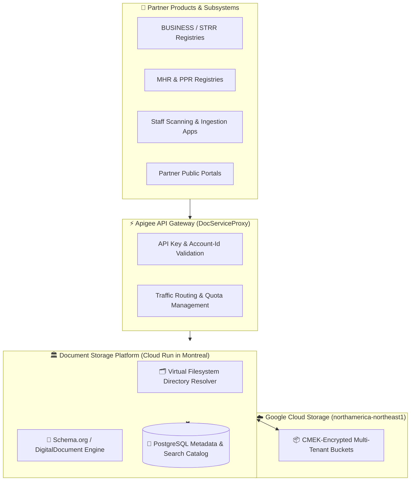
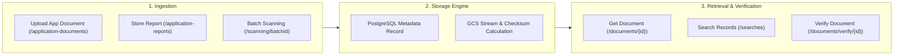

> **Enterprise document management engine wrapping Google Cloud Storage into a hierarchical virtual filesystem organized by partner product namespaces and conforming to Schema.org/DigitalDocument metadata standards.**


---

# Document Storage: Cloud Storage Virtual Filesystem & DigitalDocument API

The **Connect Document Storage** platform wraps **Google Cloud Storage (GCS)** to provide a structured, hierarchical virtual filesystem tailored for multi-tenant government applications. Rather than exposing unstructured object storage buckets, this service organizes files into well-defined product namespaces conforming to the international **[Schema.org DigitalDocument](https://schema.org/DigitalDocument)** specification.

Implemented in [`bcgov/bcros-common/document-service/doc-api`](https://github.com/bcgov/bcros-common/tree/main/document-service/doc-api) and mediated through the **Apigee Document Service Proxy**, this platform powers electronic filing storage, batch paper/microfiche scanning intake, and certified document retrieval across all British Columbia registries.

---

## 🎯 Value Proposition

* **Hierarchical Virtual Filesystem:** Maps flat Cloud Storage object keys into an intuitive, partitioned directory tree (`/{productCode}/{documentClass}/{documentType}/{entityIdentifier}/{docId}`) to prevent flat-bucket sprawl and maintain strict tenant separation.
* **Schema.org / DigitalDocument Compliance:** All stored records emit standardized JSON-LD metadata envelopes conforming to the **[schema.org/DigitalDocument](https://schema.org/DigitalDocument)** standard, ensuring semantic interoperability and unified audit trails.
* **Multi-Tenant Product Scoping:** Out-of-the-box isolation for Business Registries (`BUSINESS`), Short-Term Rental Registry (`STRR`), Manufactured Home Registry (`MHR`), Personal Property Registry (`PPR`), Name Requests (`NRO`), and application documents (`APP_FILE`).
* **High-Performance Metadata Indexing:** Backed by PostgreSQL with sub-50ms search query performance across document types, filing date ranges, consumer reference IDs, and accession batch numbers.
* **Provincial Data Residency & Security:** All documents reside in regional Google Cloud Storage buckets in `northamerica-northeast1` (Montreal) with customer-managed encryption (CMEK), AES-256 at rest, immutable object versioning, and time-bounded signed URLs.



---

## 🗂️ Virtual Filesystem Hierarchy

Google Cloud Storage is natively a flat key-value store. The Connect Document Storage service abstracts this storage layer into a deterministic, hierarchically organized virtual directory structure:

$$\text{Root} \longrightarrow \mathbf{\{productCode\}} \longrightarrow \mathbf{\{documentClass\}} \longrightarrow \mathbf{\{documentType\}} \longrightarrow \mathbf{\{entityIdentifier\}} \longrightarrow \mathbf{\{docServiceId\}}$$

### 1. Product Namespaces (`productCode`)
Isolates documents by consuming registry product:
* `BUSINESS`: Business Registry corporations, firms, cooperatives, and annual filings.
* `STRR`: Short-Term Rental Registry property certifications and host filings.
* `MHR`: Manufactured Home Registry ownership and location records.
* `PPR`: Personal Property Registry financing statements and security agreements.
* `NRO`: Name Requests and reservations.
* `APP_FILE`: Default generalized application documents and citizen attachments.

### 2. Document Classes (`documentClass`)
Categorizes records by statutory legal classification:
* `CORP`: Corporations Act filings (Articles of Incorporation, Amalgamations, Transitions).
* `COOP`: Cooperative Association filings.
* `FIRM`: Sole Proprietorships and General Partnerships.
* `LP_LLP`: Limited Partnerships and Limited Liability Partnerships.
* `MHR`: Manufactured Home Registry transactions.
* `NR`: Name Request reservations and consent letters.
* `PPR`: Personal Property security transactions.
* `SOCIETY`: Societies Act registrations and bylaws.

---

## 📜 Schema.org / DigitalDocument Alignment

Every document stored in the service adheres to the open **[Schema.org DigitalDocument](https://schema.org/DigitalDocument)** specification. Stored documents and API responses encapsulate structured metadata envelopes:

```json
{
  "@context": "https://schema.org",
  "@type": "DigitalDocument",
  "name": "Certificate of Incorporation - BC0799342.pdf",
  "description": "Certified Certificate of Incorporation issued by BC Registries",
  "url": "https://{gateway_host}/doc/api/v1/documents/DS0100001023",
  "datePublished": "2026-04-15T18:30:00Z",
  "author": "BC Registries and Online Services",
  "fileFormat": "application/pdf",
  "identifier": "DS0100001023",
  "consumerDocumentId": "80898242",
  "documentClass": "CORP",
  "documentType": "CERT",
  "productCode": "BUSINESS",
  "sha256": "e3b0c44298fc1c149afbf4c8996fb92427ae41e4649b934ca495991b7852b855"
}
```

---

## 🛠️ Core API Capabilities & Ingestion Workflows



1. **Application Document Ingestion (`POST /doc/api/v1/application-documents`):** Uploads untrusted or partner-submitted documents, storing metadata and returning a canonical `docServiceId`.
2. **Application Report Archival (`POST /doc/api/v1/application-reports/{productCode}/{entityId}/{eventId}/{reportType}`):** Automatically archives system-generated filing reports and links them to business events.
3. **High-Speed Document Streaming (`GET /doc/api/v1/documents/{docServiceId}`):** Streams binary documents securely or generates short-lived signed GCS download URLs.
4. **Physical Scanning & Batch Accessioning (`/doc/api/v1/scanning/*`):** Tracks physical scanning boxes, accession numbers, authors, and schedules for digitization programs.
5. **Document Verification (`GET /doc/api/v1/documents/verify/{consumerDocumentId}`):** Publicly verifies document authenticity, issuing date, and checksum integrity.

---

## 💻 Integration Guide & API Examples

Microservices interact with the service through the **Apigee Document Service Proxy** at `POST /doc/api/v1/application-documents`.

### Example 1: Upload and Store Document (cURL)

```bash
curl --request POST 'https://{gateway_host}/doc/api/v1/application-documents' \
  --header 'x-apikey: YOUR_API_KEY' \
  --header 'Account-Id: 1234' \
  --form 'file=@AnnualReport.pdf' \
  --form 'productCode=BUSINESS' \
  --form 'documentClass=CORP' \
  --form 'documentType=ANNUAL_REPORT' \
  --form 'consumerIdentifier=BC0799342' \
  --form 'consumerFilename=AnnualReport.pdf' \
  --form 'consumerDocumentId=80898242'
```

### Example 2: TypeScript / Nuxt Server Integration

```typescript
// server/api/documents/store-filing.post.ts
export default defineEventHandler(async (event) => {
  const { filingPdfBuffer, businessNumber, filingId, filename } = await readBody(event)

  const formData = new FormData()
  formData.append('file', new Blob([Buffer.from(filingPdfBuffer, 'base64')], { type: 'application/pdf' }), filename)
  formData.append('productCode', 'BUSINESS')
  formData.append('documentClass', 'CORP')
  formData.append('documentType', 'ANNUAL_REPORT')
  formData.append('consumerIdentifier', businessNumber)
  formData.append('consumerDocumentId', filingId)
  formData.append('consumerFilename', filename)

  // Store document in Connect Document Vault via Apigee
  const storageResult = await $fetch<{ docServiceId: string; url: string }>(
    `${process.env.APIGEE_GATEWAY_URL}/doc/api/v1/application-documents`,
    {
      method: 'POST',
      headers: {
        'x-apikey': process.env.DOC_SERVICE_API_KEY!,
        'Account-Id': '1234'
      },
      body: formData
    }
  )

  return {
    success: true,
    docServiceId: storageResult.docServiceId,
    downloadUrl: storageResult.url
  }
})
```

### Example 3: Python (FastAPI / Requests)

```python
import requests

def store_registry_document(
    pdf_bytes: bytes,
    business_id: str,
    filing_id: str,
    filename: str,
    gateway_url: str,
    api_key: str
) -> dict:
    """
    Stores a PDF in the Connect Document Storage service under the BUSINESS product namespace.
    """
    endpoint = f"{gateway_url}/doc/api/v1/application-documents"
    headers = {
        "x-apikey": api_key,
        "Account-Id": "1234"
    }
    files = {
        "file": (filename, pdf_bytes, "application/pdf")
    }
    data = {
        "productCode": "BUSINESS",
        "documentClass": "CORP",
        "documentType": "CERT",
        "consumerIdentifier": business_id,
        "consumerDocumentId": filing_id,
        "consumerFilename": filename
    }

    response = requests.post(endpoint, headers=headers, files=files, data=data, timeout=30)
    response.raise_for_status()
    return response.json()
```

---

## 📚 Related Documentation & Resources

* **[Schema.org DigitalDocument Specification](https://schema.org/DigitalDocument):** International standard for structured digital document metadata.
* **[bcros-common Document Service Repository](https://github.com/bcgov/bcros-common/tree/main/document-service/doc-api):** Open-source backend implementation.
* **[Document Service Proxy Overview (Apigee)](https://okagqp-test-bcregrestricted.apigee.io/docs/docserviceproxy/1/overview):** Apigee API Gateway overview and endpoints.
* **[Document Creation Service](/services/document-creation):** Managed Gotenberg engine for generating PDFs with BC Sans fonts.
* **[Document Sanitization Service](/services/document-sanitization):** Sandboxed zero-trust malware and macro stripping service.
