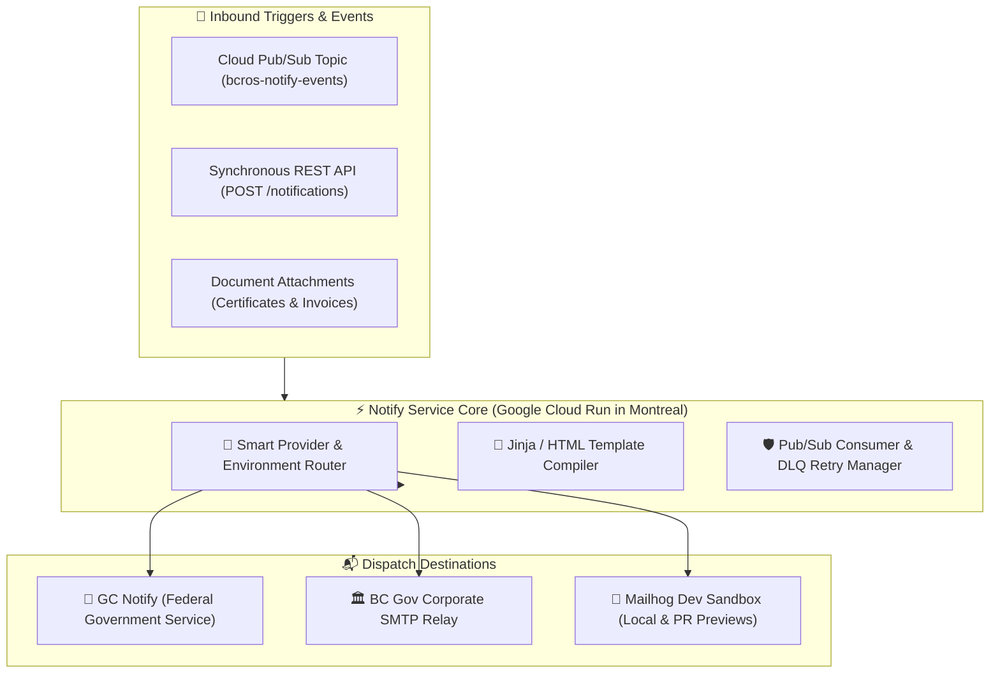
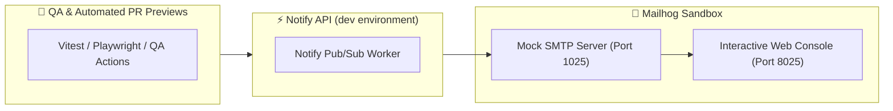

> **Multi-tenant notification engine wrapping diverse email providers with asynchronous Google Cloud Pub/Sub delivery, dynamic HTML templating, and integrated Mailhog developer sandboxes.**


---

# Notify: Managed Email & Event-Driven Notification Service

The **Connect Notify** service provides a centralized, resilient notification engine designed to handle transactional emails, statutory citizen notices, and payment receipts across all British Columbia registries. Implemented in [`bcgov/bcros-common/notify-service/notify-api`](https://github.com/bcgov/bcros-common/tree/main/notify-service/notify-api), this platform abstracts underlying email vendors (such as **GC Notify** and corporate SMTP relays) while offering asynchronous **Google Cloud Pub/Sub** queuing and a dedicated **Mailhog sandbox** for zero-risk local and development testing.

---

## 🎯 Value Proposition

* **Multi-Provider Email Orchestration:** Unifies disparate dispatch mechanisms—including **GC Notify (Government of Canada)**, BC Gov internal SMTP relays, and transactional providers—behind a single, consistent API.
* **Safe Mailhog Testing Sandbox:** In `dev` and automated testing environments, 100% of outbound messages are intercepted by an embedded **[Mailhog](https://github.com/mailhog/MailHog)** instance with an interactive web console—eliminating any risk of spamming real citizens or business owners during PR previews.
* **Asynchronous Pub/Sub Decoupling:** Decouples user-facing API routes from slow SMTP network handshakes via **Google Cloud Pub/Sub**, ensuring sub-second response times on filing submissions.
* **Guaranteed Delivery & Dead-Letter Queues (DLQ):** Employs exponential backoff retry algorithms and dead-letter queues to gracefully handle upstream gateway outages without losing transactional messages.
* **Dynamic HTML Templating & Attachment Bundling:** Renders responsive, brand-compliant HTML email layouts and bundles generated PDF filings, statements, or receipts directly from **[Document Creation](/services/document-creation)** and **[Document Storage](/services/document-storage)**.



---

## 🔀 Multi-Provider & Environment Routing

The Notify service dynamically routes outbound messages based on the operating environment and target configuration:

| Provider / Channel | Target Environment | Use Cases & Purpose | Deliverability & Safety |
| :--- | :--- | :--- | :--- |
| **GC Notify** | Production & Staging | High-deliverability transactional emails, statutory filings, and STRR certifications. | Verified SPF/DKIM/DMARC with 99.9% citizen inbox delivery. |
| **BC Gov SMTP** | Production & Staging | Internal government communications and restricted corporate network alerts. | Authenticated provincial network relay with strict firewall controls. |
| **Mailhog Sandbox** | Development & Test | Pull Request preview environments, unit/E2E test suites, and local developer stacks. | **100% trapped locally;** zero external network calls, visual web UI for inspecting HTML & links. |

---

## 🐗 Zero-Risk Testing with Mailhog

One of the greatest hazards in multi-tier microservice architectures is the accidental broadcast of test emails to real citizen addresses during regression testing or staging migrations.

The Connect Notify service eliminates this risk:
1. In `dev` and `test` environments, the SMTP host is configured to point to the **Mailhog** daemon.
2. Mailhog accepts all SMTP connections, discards external transmission, and stores messages in an in-memory database.
3. Developers and QA engineers open the **Mailhog Web UI** (`http://localhost:8025` or test cluster URL) to visually review:
   * HTML rendering across mobile and desktop viewport frames.
   * Template variable substitution accuracy.
   * Action button hyperlinks and deep-link tokens.
   * Binary attachment integrity (e.g. previewing attached PDF certificates).



---

## 🛡️ Asynchronous Pub/Sub Architecture

For high-throughput applications, services emit events to the `bcros-notify-events` Google Cloud Pub/Sub topic rather than executing blocking HTTP requests:

* **Non-Blocking Ingestion:** The client microservice publishes a lightweight JSON event payload and immediately returns a `200 OK` to the user.
* **Worker Auto-Scaling:** Cloud Run Pub/Sub push subscribers automatically scale from 0 to N worker instances based on backlog depth.
* **Idempotent Delivery:** Each notification includes an idempotency key (`message_id` or `filing_id`), preventing duplicate dispatches in the event of consumer retries.
* **Dead-Letter Queue (DLQ):** After 5 failed retry attempts (e.g. invalid recipient syntax or permanent upstream failure), messages are routed to a dead-letter topic for SRE investigation.

---

## 💻 Integration Guide & API Examples

Microservices interact with the Notify service through the **Apigee API Gateway** at `POST /notify/api/v1/notifications` or by publishing messages to Google Cloud Pub/Sub.

### Example 1: Synchronous Notification Dispatch (cURL)

```bash
curl --request POST 'https://{gateway_host}/notify/api/v1/notifications' \
  --header 'x-apikey: YOUR_API_KEY' \
  --header 'Content-Type: application/json' \
  --data '{
    "recipients": "citizen@example.com",
    "content": {
      "subject": "Confirmation of Annual Report Filing - BC0799342",
      "body": "<p>Hello,</p><p>Your Annual Report has been successfully submitted and certified.</p>"
    },
    "notifyType": "EMAIL",
    "priority": "HIGH"
  }'
```

### Example 2: TypeScript / Nuxt Integration with PDF Attachment

```typescript
// server/api/notifications/send-filing-receipt.post.ts
export default defineEventHandler(async (event) => {
  const { recipientEmail, businessName, filingId, pdfBase64 } = await readBody(event)

  const payload = {
    recipients: recipientEmail,
    content: {
      subject: `Official Filing Receipt: ${businessName}`,
      body: `
        <div style="font-family: sans-serif; color: #003366;">
          <h2>Filing Confirmation</h2>
          <p>Thank you for submitting your filing for <strong>${businessName}</strong>.</p>
          <p>Your official filing certificate is attached to this email.</p>
        </div>
      `,
      attachments: [
        {
          fileName: `Certificate-${filingId}.pdf`,
          fileBytes: pdfBase64,
          fileUrl: null
        }
      ]
    },
    notifyType: 'EMAIL',
    priority: 'STANDARD'
  }

  // Dispatch via Apigee Gateway
  const result = await $fetch<{ id: string; status: string }>(
    `${process.env.APIGEE_GATEWAY_URL}/notify/api/v1/notifications`,
    {
      method: 'POST',
      headers: {
        'x-apikey': process.env.NOTIFY_API_KEY!,
        'Content-Type': 'application/json'
      },
      body: payload
    }
  )

  return { success: true, notificationId: result.id }
})
```

### Example 3: Python (Asynchronous Pub/Sub Event Publishing)

```python
import json
from google.cloud import pubsub_v1

publisher = pubsub_v1.PublisherClient()
topic_path = publisher.topic_path("bcgov-connect-prod", "bcros-notify-events")

def publish_notification_event(recipient: str, subject: str, template_data: dict):
    """
    Publishes an asynchronous notification message to Google Cloud Pub/Sub.
    """
    message_data = {
        "recipients": recipient,
        "templateName": "annual_report_confirmation",
        "templateVars": template_data,
        "notifyType": "EMAIL",
        "priority": "HIGH"
    }

    # Encode payload to bytes
    data_bytes = json.dumps(message_data).encode("utf-8")
    
    # Publish non-blocking message
    future = publisher.publish(topic_path, data=data_bytes, event_type="FILING_COMPLETE")
    return future.result()
```

---

## 📚 Related Documentation & Resources

* **[bcros-common Notify API Repository](https://github.com/bcgov/bcros-common/tree/main/notify-service/notify-api):** Open-source codebase and database migrations.
* **[Mailhog Documentation](https://github.com/mailhog/MailHog):** Developer mock SMTP server and visual testing tool.
* **[GC Notify Platform](https://notification.canada.ca/):** Government of Canada transactional notification service.
* **[Document Creation Service](/services/document-creation):** Generate PDF receipts and certificates for attachment.
* **[Document Storage Service](/services/document-storage):** Retrieve archived filings and signed attachment URLs.
