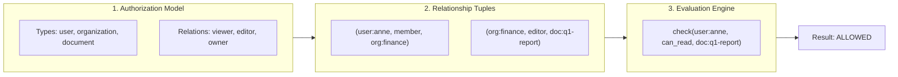

> **Decouple authorization from application logic. Scale complex permissions, nested teams, and dynamic resource sharing with ultra-low latency graph evaluation.**


---

## 📖 What is OpenFGA?

**[OpenFGA](https://openfga.dev)** is a high-performance, open-source Fine-Grained Authorization engine designed to handle modern access control models. Donated to the **Cloud Native Computing Foundation (CNCF)** by Auth0/Okta, OpenFGA solves authorization complexity by shifting permissions out of bespoke application code, hardcoded database `role` columns, and brittle `if/else` checks into a centralized, queryable relationship graph.

Rather than your application asking *"What roles does this user have in table X?"*, your service simply queries the OpenFGA authorization engine:

```text
check(user: "user:anne", relation: "can_approve", object: "application:app-9012")
  ➔ ALLOWED (true / false)
```

---

## 🎯 Value Proposition

* **Graph-Based Permissions (ReBAC):** Direct permissions (`anne is owner`), group memberships (`anne is member of team:finance`), and object hierarchies (`folder:public contains document:summary`) are modeled as relationships.
* **Decoupled Architecture:** User identity is represented simply as a string identifier (`user:anne`, `user:idir/thor`, `user:bcsc/12345`), decoupling permissions from identity providers.
* **Sub-Millisecond Evaluation:** Fast in-memory graph traversal algorithms resolve deep inheritance trees in single-digit milliseconds.
* **Universal Auditability:** Centralized authorization tuples provide a transparent, tamper-evident log of who granted which access to whom.
* **Google Zanzibar Heritage:** Built on the proven principles of Google's global authorization architecture to scale to billions of daily checks without performance degradation.



---

## 🏛️ The Google Zanzibar Heritage

OpenFGA is directly inspired by **Google Zanzibar**, the unified authorization system that powers access control across Google Drive, YouTube, Google Cloud, and Google Photos.

In 2019, Google published its seminal whitepaper: **[*Zanzibar: Google's Consistent, Global Authorization System*](https://research.google/pubs/pub48190/)**, describing a system capable of evaluating tens of billions of authorization checks per second with sub-millisecond latency. 

---

## ⚙️ Core Concepts

### 1. Authorization Model (DSL)
Your authorization model defines the types of entities in your domain and the rules governing relationships between them. Models are written in a human-readable Domain Specific Language (DSL):

```fga
model
  schema 1.1

type user

type organization
  relations
    define member: [user]
    define admin: [user]

type document
  relations
    define parent: [organization]
    define owner: [user]
    define editor: [user] or owner
    define viewer: [user] or editor or member from parent
    define can_edit: editor
    define can_view: viewer
```

### 2. Relationship Tuples
A relationship tuple is the atomic unit of permission state in OpenFGA:

$$\text{(User, Relation, Object)}$$

| User (Subject) | Relation | Object (Target) | Explanation |
| :--- | :--- | :--- | :--- |
| `user:anne` | `member` | `organization:ministry-citizens-services` | Anne is a member of CITZ. |
| `organization:ministry-citizens-services` | `parent` | `document:budget-2026` | The budget document belongs to CITZ. |
| `user:bob` | `editor` | `document:budget-2026` | Bob has direct editing rights on the budget document. |

### 3. Check & Query APIs
Applications interact with OpenFGA via simple, high-speed REST and gRPC endpoints:

* **`check`**: Evaluates whether a user has a specific relation to an object.
  ```json
  {
    "tuple_key": {
      "user": "user:anne",
      "relation": "can_view",
      "object": "document:budget-2026"
    }
  }
  ```
* **`list-objects`**: Returns all resources of a given type that a user can access (e.g., *"List all statutory filings Anne can view"*).
* **`list-users`**: Returns all subjects that have a given relation to a resource (e.g., *"Who can approve this grant?"*).

### 4. Contextual Tuples (Dynamic Attributes)
For ephemeral or runtime attributes (e.g., IP boundaries, time-of-day, or request-specific flags), applications can supply **contextual tuples** during the `check` request. These are evaluated in-memory without needing database writes.

---

## 🚀 OpenFGA on the Connect Platform

The Connect Platform provides centrally managed OpenFGA instances with enterprise governance:

1. **Self-Serve Store Provisioning:** Create and manage authorization stores, client keys, and environment models (`dev`, `test`, `prod`) directly within [`hub.connect`](https://hub.connect).
2. **Federated Identity Binding:** Native compatibility with BC Services Card (BCSC), BCeID, and IDIR subject strings.
3. **Multi-Tenant Isolation:** Ministry applications operate within cryptographically isolated store boundaries with zero cross-tenant contamination.
4. **SRE & High Availability:** Monitored 24/7 with continuous latency tracing, SLO dashboards, and automated failover.

---

## 📚 Training Materials & Official Documentation

Accelerate your understanding of Fine-Grained Authorization and ReBAC modeling with these curated resources:

### 📖 Documentation & Guides
* **[Official OpenFGA Documentation](https://openfga.dev/docs/fga):** Comprehensive tutorials, API references, architecture guides, and schema definitions.
* **[OpenFGA GitHub Repository](https://github.com/openfga/openfga):** Source code, release notes, issue tracker, and community roadmaps.
* **[Modeling Guides & Patterns](https://openfga.dev/docs/modeling):** Step-by-step recipes for modeling RBAC, ABAC, ReBAC, multitenancy, and parent-child hierarchies.

### 🛠️ Interactive Tools & Sandboxes
* **[OpenFGA Interactive Playground](https://play.fga.dev):** Visual browser-based modeling workbench where you can edit DSL schemas, define test tuples, and validate check assertions live.
* **[OpenFGA CLI (`fga`)](https://openfga.dev/docs/getting-started/cli):** Command-line tool for validating schemas, running automated model tests, and managing stores in CI/CD pipelines.

### 🔬 Academic & Architecture Foundations
* **[Google Zanzibar Research Paper (2019)](https://research.google/pubs/pub48190/):** The original academic paper detailing the architecture, consistency model, and evaluation mechanics behind relationship-based authorization at global scale.
* **[CNCF Sandbox Project Overview](https://www.cncf.io/projects/openfga/):** Open governance, security audits, and cloud-native landscape integration.

### 💻 Client SDKs
Official, type-safe SDKs are available for all major enterprise platforms:
* **[Node.js / TypeScript SDK](https://github.com/openfga/js-sdk)** (`@openfga/sdk`)
* **[Go SDK](https://github.com/openfga/go-sdk)**
* **[Python SDK](https://github.com/openfga/python-sdk)**
* **[.NET SDK](https://github.com/openfga/dotnet-sdk)**
* **[Java SDK](https://github.com/openfga/java-sdk)**

---

## 🤝 Need Integration Assistance?

Connect Platform architects host weekly co-design sessions to help ministry teams model their domain permissions:

* **Teams Channel:** Drop by `#connect-dev-help` for schema reviews and integration advice.
* **Architecture Reviews:** Submit your draft DSL models to the platform team via [`hub.connect`](https://hub.connect).
