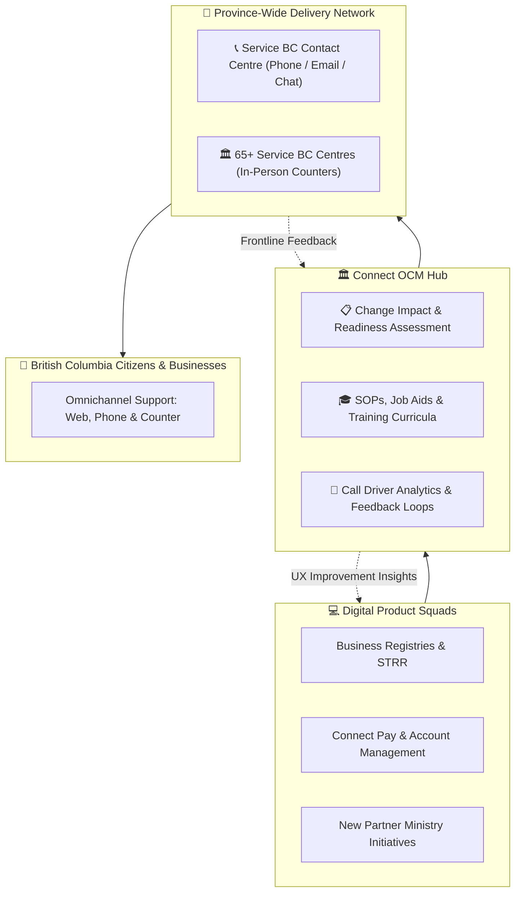

> **Strategic change enablement and operational readiness service connecting digital partner programs with the Service BC Contact Centre and a province-wide network of 65+ physical service delivery offices.**

---

# Organizational Change Management: OCM & Service Delivery Network

The **Connect Organizational Change Management (OCM)** practice serves as the vital bridge between digital engineering teams and British Columbia's frontline service delivery network. When product teams launch new digital capabilities—such as modern Business Registry filings, Short-Term Rental compliance tools, or updated fee schedules—our OCM specialists ensure operational readiness across the **Service BC Contact Centre** and a province-wide network of **65+ physical Service BC Centres**.

By aligning business process changes, developing frontline training curricula, and establishing rapid escalation paths, Connect OCM guarantees a seamless, equitable, and compassionate omnichannel experience for all citizens and businesses.

---

## 🎯 Value Proposition

* **Operationalizing Digital Innovation:** Translates technical release notes and legislative amendments into actionable Standard Operating Procedures (SOPs) and agent job aids before features hit production.
* **Turnkey Contact Centre Readiness:** Prepares the **Service BC Contact Centre** agents with customized call flows, knowledge base articles, and Tier 1 / Tier 2 escalation protocols to handle inbound phone, email, and live chat inquiries.
* **Province-Wide In-Person Enablement:** Equips over 65 physical Service BC delivery offices across urban, rural, and Indigenous communities to deliver in-person counter assistance, identity verification, and payment processing.
* **Proactive Change Risk Mitigation:** Conducts structured stakeholder readiness assessments and change impact analyses (utilizing the Prosci / ADKAR framework) to eliminate service delivery bottlenecks.
* **Bi-Directional Voice of the Citizen:** Channels frontline call driver telemetry and in-person counter feedback directly back into product agile squads to drive continuous UX enhancements.

---

## 🏛️ The 4 Pillars of Connect OCM

### 1. Change Strategy & Impact Assessment
Every digital rollout begins with a thorough operational impact analysis:
* **Stakeholder Mapping:** Identifies affected user groups (citizens, legal professionals, ministry staff, contact centre agents, counter CSRs).
* **Change Readiness Diagnostics:** Evaluates the magnitude of business process changes and develops tailored communication kits and transition schedules.
* **Executive & Stakeholder Alignment:** Facilitates cross-ministry working groups to ensure alignment between policy directives, legal mandates, and operational execution.

### 2. Contact Centre Onboarding & Tiered Escalations
Connect OCM deeply embeds new services into the **Service BC Contact Centre**:
* **Comprehensive Knowledge Base Articles:** Authors searchable, step-by-step guidance for agents in the provincial knowledge management system.
* **Tiered Escalation Matrix:** Establishes clear handoff boundaries between Tier 1 general inquiries, Tier 2 specialized registry examiners, and Tier 3 digital platform engineering squads.
* **Simulation & Soft-Launch Dry Runs:** Conducts live mock-call training sessions to build agent confidence prior to public go-live.

### 3. In-Person Delivery Network (65+ Service BC Centres)
Digital equity requires robust in-person support for citizens without reliable high-speed internet or digital devices:
* **Assisted Digital Filing:** Trains Customer Service Representatives (CSRs) across all 65+ Service BC offices to guide citizens through online registrations.
* **In-Person Identity Verification:** Establishes counter procedures for verifying government-issued photo IDs and setting up **BC Services Card** accounts.
* **Counter Payment Processing:** Enables citizens and business owners to pay registry and licensing fees in person using cash, debit, or certified cheque.

### 4. Continuous Operational Feedback Loops
OCM does not stop at go-live; it establishes ongoing telemetry loops:
* **Call Driver Categorization:** Analyzes top inquiry reasons and common confusion areas reported by contact centre staff.
* **Sprint Review Representation:** OCM leads attend product agile sprint reviews to share frontline insights directly with UX designers and developers.
* **Iterative Guidance Refinement:** Updates SOPs and public help articles in real-time as application features evolve.

---

## 🧭 Partner Onboarding & Engagement Timeline

Engaging the Connect OCM team follows a structured roadmap synchronized with your product release schedule:

| Milestone | Timing | Core Deliverables & Activities |
| :--- | :--- | :--- |
| **1. Discovery & Impact Assessment** | **T - 12 Weeks** | • Initial change readiness workshop • High-level stakeholder mapping and journey reviews • Identification of required contact centre and counter workflows |
| **2. Curriculum & SOP Development** | **T - 6 Weeks** | • Draft Standard Operating Procedures (SOPs) • Tier 1 / Tier 2 escalation workflows defined • Knowledge base articles drafted and validated with policy leads |
| **3. Frontline Training & Dry-Runs** | **T - 2 Weeks** | • Contact centre agent training webinars and scenario roleplaying • Service BC delivery office communications and job-aid distribution • Operational sign-off from Service BC Operations leadership |
| **4. Go-Live & Dedicated Hypercare** | **Go-Live to T + 4 Weeks** | • Real-time command centre monitoring during launch day • Daily contact centre call volume and escalation triage syncs • Frontline feedback synthesis delivered to product development backlog |

---

## 🤝 Getting Started with Connect OCM

Partner teams looking to onboard a new digital service or prepare for major policy updates can initiate an OCM engagement:

1. **Submit an Onboarding Request:** Contact the Connect Platform team via [`hub.connect`](https://hub.connect) or email the OCM practice lead.
2. **Kickoff Readiness Assessment:** Participate in a 2-hour discovery session to map your release milestones and identify user touchpoints.
3. **Collaborative Execution:** Work alongside dedicated OCM specialists to author knowledge articles, train frontline teams, and ensure an exceptional launch experience.

---

## 📚 Related Documentation & Resources

* **[Service BC Locations & Directory](https://www2.gov.bc.ca/gov/content/governments/organizational-structure/ministries-organizations/ministries/citizens-services/servicebc):** Comprehensive directory of the 65+ Service BC Centres across British Columbia.
* **[Product Owner Hub](/product-owners):** Guidance for product owners on roadmapping, governance, and multi-disciplinary squad collaboration.
* **[Technical Lead Overview](/technical):** Architecture and engineering standards powering Connect digital services.
* **[Authentication & Team Accounts](/services/auth):** Learn how user identities and BC Services Card authentications are handled across digital and counter channels.
