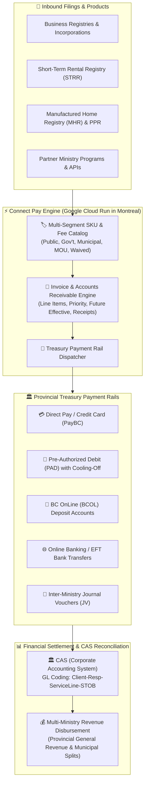
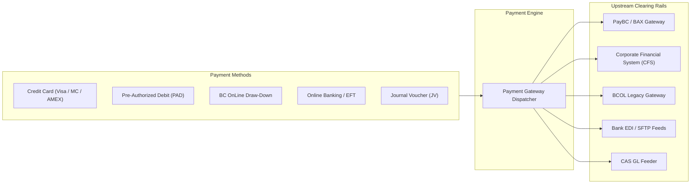
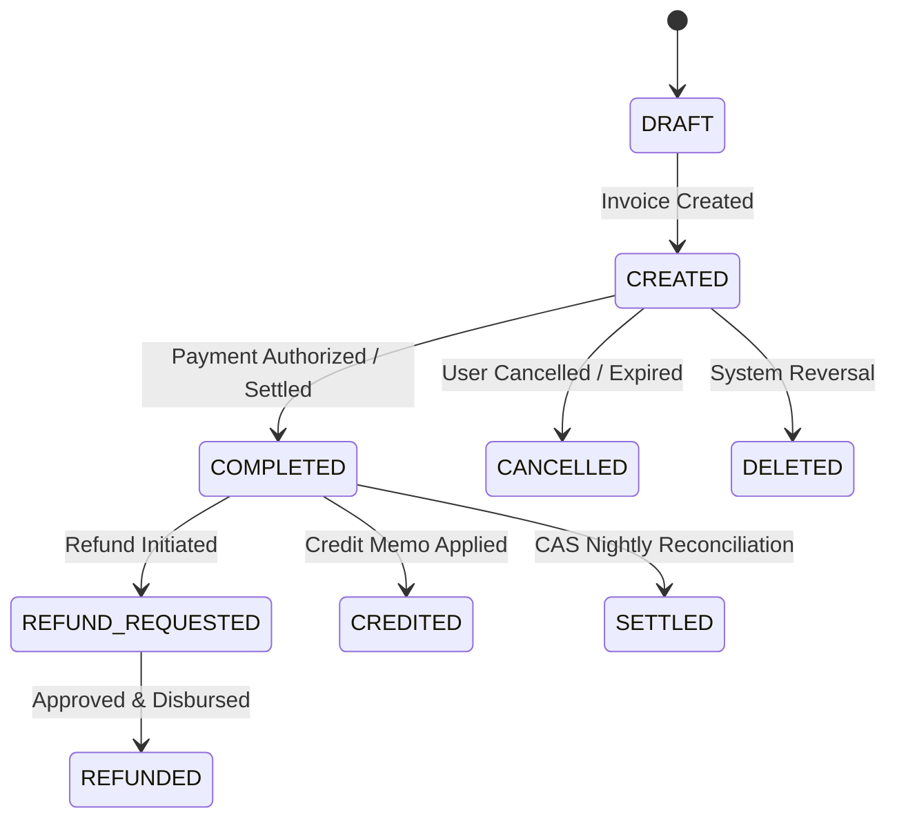
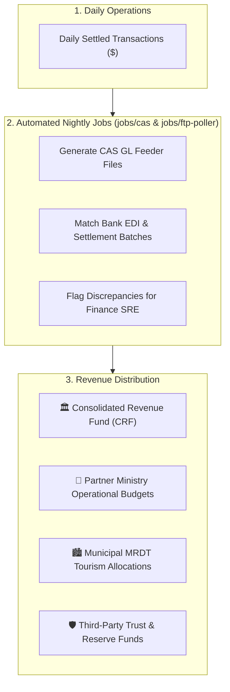

> **Enterprise eCommerce platform for British Columbia government services—managing multi-segment fee catalogs, line-item invoicing, Provincial Treasury payment (Direct Pay, PAD, BCOL, EFT, Online Banking, JV), automated CAS GL reconciliation, and revenue disbursements.**


---

# Connect Pay: Full-Spectrum Provincial eCommerce Platform

The **Connect Pay** platform is the enterprise financial engine powering commercial and statutory transactions across the Province of British Columbia. Implemented in [`bcgov/sbc-pay`](https://github.com/bcgov/sbc-pay) and mediated through the **Apigee API Gateway**, Connect Pay provides an end-to-end eCommerce ecosystem that abstracts technical squads from the immense complexity of government financial operations.

Rather than acting solely as a credit card checkout page, Connect Pay manages the entire financial lifecycle: configurable multi-segment SKU fee schedules, dynamic line-item invoicing, multi-channel payment rails certified by the **BC Provincial Treasury**, automated **CAS (Corporate Accounting System)** General Ledger reconciliation, and multi-ministry revenue disbursements.

---

## 🏗️ The Problem: Financial Fragmentation in Government

Building transactional public sector services without a centralized eCommerce engine introduces severe financial and operational overhead:

* **Siloed Payment Gateways:** Program areas independently integrating with commercial payment gateways lack support for specialized provincial payment rails such as **Pre-Authorized Debit (PAD)**, **BC OnLine (BCOL)** deposit accounts, and **Inter-Ministry Journal Vouchers (JV)**.
* **Complex Multi-Segment Fee Rules:** Statutory pricing varies drastically between general citizens, municipal partners, internal ministries, and Memorandum of Understanding (MOU) signatories—leading to fragile, hardcoded pricing logic across disparate applications.
* **Manual Journal Voucher & GL Reconciliation:** Finance teams forced to reconcile bank deposits, merchant fees, chargebacks, and General Ledger strings manually at month-end.
* **Compliance & Audit Overhead:** Strict provincial accounting rules mandated by the *Financial Administration Act (FAA)* and the Office of the Comptroller General (OCG) require immutable audit logging, standardized PDF receipts, and strict separation of funds.

---

## 🎯 Value Proposition

* **Multi-Segment SKU & Fee Catalog:** Dynamic pricing matrix allowing product teams to define SKUs once and enforce segment-specific rates (Public, Government, Municipal, MOU, Waived, Priority, Future-Effective) with automated GST/PST tax calculations.
* **All Provincial Treasury Payment Rails:** Native support for all payment instruments authorized by the Provincial Treasury: **Direct Pay (Credit Card / PayBC)**, **Pre-Authorized Debit (PAD)**, **BC OnLine (BCOL)** deposit accounts, **Online Banking / Bill Payment**, **Electronic Funds Transfer (EFT)**, and **Internal Journal Vouchers (JV)**.
* **Automated CAS General Ledger Reconciliation:** Daily automated reconciliation and batch feeder jobs interfacing with the Province's **Corporate Accounting System (CAS)**, mapping transactions directly to Client, Responsibility, Service Line, and STOB account strings.
* **Turnkey Accounts Receivable & Statementing:** Comprehensive invoice lifecycle management (`DRAFT` $\rightarrow$ `CREATED` $\rightarrow$ `PAID` $\rightarrow$ `SETTLED`), automated PDF receipt generation, monthly electronic statement generation (PDF/CSV), and credit memo processing.
* **Multi-Party Revenue Disbursement:** Automatically calculates and routes collected revenue splits to provincial ministries, municipal tax authorities (e.g. MRDT tourism splits), and external trust accounts.
* **Composable Frontend Integration:** Direct compatibility with **[`@sbc-connect/nuxt-pay`](/services/connect-nuxt)**, providing sticky real-time fee widgets (`<ConnectFeeWidget />`) and hosted checkout layouts.



---

## 🏷️ The Multi-Segment SKU & Fee Catalog

Connect Pay replaces hardcoded pricing with a unified, database-backed **Fee Schedule & SKU Catalog**. When an application triggers a transaction, it supplies its SKU (e.g., `BCINC` for British Columbia Incorporation) and partner parameters; Connect Pay evaluates the pricing matrix dynamically.

### 1. Pricing Segments & Rate Classes

| Segment / Class | Target Audience | Fee Calculation Behavior | Accounting Treatment |
| :--- | :--- | :--- | :--- |
| **Public** | Citizens, entrepreneurs, legal agents | Full statutory filing fee + priority / service fee + applicable taxes. | Settled via Credit Card, PAD, BCOL, or Online Banking. |
| **Government / Internal** | Provincial ministries & Crown corporations | Statutory fees waived or settled internally at cost. | Transferred via **Journal Voucher (JV)** without credit card interchange fees. |
| **Municipal / Local Gov** | Cities, regional districts, First Nations | Preferential statutory discount or legislative fee exemption. | Billed via monthly statement account or PAD. |
| **MOU Partner** | Inter-agency agreements & federal partners | Contractually negotiated volume pricing and revenue shares. | Automated periodic disbursement and custom GL coding. |
| **Staff Waived** | Hardship exemptions, registry corrections | Total amount reduced to $0.00 with mandatory staff justification code. | Logged in audit trail with staff IDIR reference. |

### 2. Line-Item Fee Composition

Every invoice generated by Connect Pay decomposes into clear, auditable line items:

$$\mathbf{\text{Total Invoice Amount}} = \text{FilingFee} + \text{PriorityFee} + \text{FutureEffectiveFee} + \text{ServiceFee} + \text{Tax (GST/PST)}$$

* **Base Statutory Filing Fee (`filingFees`):** The legislative fee mandated for the transaction (e.g., $350.00 for a corporate incorporation).
* **Priority Processing Fee (`priorityFees`):** Optional expedite surcharge (typically $100.00) for priority queue processing by registry examiners.
* **Future-Effective Filing Fee (`futureEffectiveFees`):** Statutory fee (typically $100.00) for scheduling filings to take effect on a future calendar date.
* **Service / Merchant Processing Fee (`serviceFees`):** Pass-through processing fee (e.g., $1.50) offsetting payment gateway operations.
* **Tax Engine (`tax.gst`, `tax.pst`):** Automatic jurisdiction-based tax calculation applied strictly where statutory exemptions do not apply.

---

## 🏛️ Provincial Treasury Payment Rails & Methods

Connect Pay provides certified integrations with all payment rails authorized by the **BC Ministry of Finance and Provincial Treasury**:



### 1. Direct Pay / Credit Card (PayBC)
* **Experience:** Real-time browser handoff to the hosted **PayBC / BAX** checkout gateway.
* **Security:** Card data never touches Connect servers; full PCI-DSS Level 1 compliance with 3D-Secure fraud verification.
* **Cards Supported:** Visa, MasterCard, American Express, and Visa/Mastercard Debit.

### 2. Pre-Authorized Debit (PAD)
* **Experience:** Frictionless, non-interactive checkout for registered high-volume business accounts.
* **Mechanism:** Debits funds directly from Canadian bank transit, institution, and account numbers via automated Canadian Payments Association (CPA) clearing batches.
* **Cooling-Off Period:** Features a statutory cooling-off window for new banking arrangements before initial debits execute.

### 3. BC OnLine (BCOL) Deposit Accounts
* **Experience:** Draw-down account support for law firms, search houses, and enterprise registry agents with existing BC OnLine deposit profiles.
* **Mechanism:** Validates account balance and authorization tokens in real-time before releasing filings.

### 4. Online Banking / Bill Payment
* **Experience:** Payees add **"BC Registries and Online Services"** as a bill payee in their online banking portal (e.g. RBC, TD, BMO, CIBC, Scotiabank, Central 1 Credit Unions).
* **Settlement:** Electronic data interchange (EDI) bank settlement files are matched automatically against pending invoice reference numbers.

### 5. Electronic Funds Transfer (EFT) & Wires
* **Experience:** Designed for enterprise partners remitting lump-sum payments.
* **Reconciliation:** Connect Pay's automated bank poller ingests electronic bank statements, matching deposits against open customer accounts.

### 6. Internal Journal Vouchers (JV / Inter-Ministry)
* **Experience:** Eliminates credit card processing fees for provincial ministries and programs.
* **GL String Transfer:** Debits the purchasing ministry's General Ledger account (`Client-Responsibility-ServiceLine-STOB-Project`) and credits the service provider's revenue string inside CAS.

---

## 🧾 Invoice Lifecycle & Accounts Receivable (AR)

Connect Pay maintains a state-machine driven Accounts Receivable ledger:



* **Dynamic Invoicing:** Supports multi-item transactions (e.g. an Annual Report fee $+$ Certificate of Good Standing in a single invoice).
* **Payment Receipts:** Instant on-demand generation of certified PDF receipts with official BC Gov headers, payment reference numbers, and GST registration details (`POST /payment-requests/{id}/receipts`).
* **Periodic Statements:** Monthly account statement generation available in both human-readable PDF and data-dense CSV formats (`GET /accounts/{accountId}/statements`).
* **Automated Refund Processing:** Routes refund approvals back through original payment instruments (credit card charge reversals, PAD credits, BCOL balance top-ups, or CAS Accounts Payable cheques).

---

## 📊 CAS Reconciliation & Multi-Party Revenue Disbursement

All funds processed through Connect Pay are subject to strict financial controls mandated by the *Financial Administration Act*:



1. **Nightly CAS Feeder Batches:** Automated cron jobs running on Google Cloud Run aggregate the day's settled transactions and format General Ledger journal entries conforming to provincial CAS specifications.
2. **GL Account Code Mapping:** Maps product SKUs to multi-part financial strings:
   $$\mathbf{\text{GL Code}} = \underbrace{\text{Client}}_{3\text{ digits}} - \underbrace{\text{Responsibility}}_{5\text{ digits}} - \underbrace{\text{Service Line}}_{5\text{ digits}} - \underbrace{\text{STOB}}_{4\text{ digits}} - \underbrace{\text{Project}}_{7\text{ digits}}$$
3. **Automated Revenue Disbursement:** Allocates funds between ministries (e.g., dividing Short-Term Rental registration fees between provincial oversight and local municipal Municipal and Regional District Tax (MRDT) partners).

---

## 💻 Developer Quick-Start & API Reference

Microservices interact with Connect Pay through the **Apigee API Gateway** at `https://{gateway_host}/pay/api/v1/`.

### Step 1: Calculate Real-Time Fees (`GET /pay/api/v1/fees/{business_type}/{filing_type}`)

Before initiating a filing, query Connect Pay to determine dynamic fees:

```bash
curl --request GET 'https://{gateway_host}/pay/api/v1/fees/BC/BCINC?priority=true&futureEffective=true' \
  --header 'x-apikey: YOUR_API_KEY' \
  --header 'Account-Id: 1234'
```

#### Response:
```json
{
  "filingTypeCode": "BCINC",
  "filingType": "Incorporation",
  "filingFees": 350.0,
  "priorityFees": 100.0,
  "futureEffectiveFees": 100.0,
  "serviceFees": 1.5,
  "tax": {
    "gst": 0.0,
    "pst": 0.0
  },
  "total": 551.50
}
```

---

### Step 2: Create a Payment Request Invoice (`POST /pay/api/v1/payment-requests`)

Creates an invoice and initiates payment resolution based on the user account's default payment method:

```bash
curl --request POST 'https://{gateway_host}/pay/api/v1/payment-requests' \
  --header 'x-apikey: YOUR_API_KEY' \
  --header 'Account-Id: 1234' \
  --header 'Content-Type: application/json' \
  --data '{
    "filingInfo": {
      "filingIdentifier": "BC0799342",
      "folioNumber": "PROJECT-ALPHA-2026",
      "filingTypes": [
        {
          "filingTypeCode": "BCINC",
          "priority": true,
          "futureEffective": false
        }
      ]
    },
    "businessInfo": {
      "businessIdentifier": "BC0799342",
      "corpType": "BC"
    },
    "details": [
      {
        "label": "Incorporation Application (Priority)",
        "value": "BC0799342"
      }
    ]
  }'
```

#### Response:
```json
{
  "id": 1029482,
  "statusCode": "CREATED",
  "isPaymentActionRequired": true,
  "paymentMethod": "DIRECT_PAY",
  "paymentSystem": "PAYBC",
  "paymentUrl": "https://{gateway_host}/pay/checkout/1029482?return_url=https://myservice.gov.bc.ca/return",
  "total": 451.50
}
```

---

### Step 3: Completing Payment for Partner Apps

* **If `isPaymentActionRequired` is `true` (Credit Card / Direct Pay):** Redirect the user's browser to `paymentUrl`. The hosted Connect Pay UI handles 3D-Secure verification and redirects the user back to your configured `return_url`.
* **If `isPaymentActionRequired` is `false` (Pre-Authorized Debit or BCOL):** The invoice is automatically approved and queued for batch settlement. Your application can proceed immediately without user redirection.

---

### Step 4: Nuxt 4 Server-Side Integration (TypeScript)

```typescript
// server/api/payment/checkout.post.ts
export default defineEventHandler(async (event) => {
  const { filingId, businessIdentifier, filingTypeCode, isPriority } = await readBody(event)

  const paymentPayload = {
    filingInfo: {
      filingIdentifier: filingId,
      filingTypes: [
        {
          filingTypeCode: filingTypeCode,
          priority: isPriority
        }
      ]
    },
    businessInfo: {
      businessIdentifier: businessIdentifier,
      corpType: 'BC'
    }
  }

  // Create payment invoice via Connect Pay API
  const invoice = await $fetch<{
    id: number
    statusCode: string
    isPaymentActionRequired: boolean
    paymentUrl?: string
  }>(`${process.env.APIGEE_GATEWAY_URL}/pay/api/v1/payment-requests`, {
    method: 'POST',
    headers: {
      'x-apikey': process.env.PAY_API_KEY!,
      'Account-Id': event.context.accountId
    },
    body: paymentPayload
  })

  return {
    invoiceId: invoice.id,
    requiresRedirect: invoice.isPaymentActionRequired,
    redirectUrl: invoice.paymentUrl
  }
})
```

---

### Step 5: Python (FastAPI / Requests)

```python
import requests

def initiate_connect_payment(
    gateway_url: str,
    api_key: str,
    account_id: str,
    filing_id: str,
    business_id: str,
    filing_type: str,
    priority: bool = False
) -> dict:
    """
    Creates an invoice in Connect Pay and returns payment instructions.
    """
    endpoint = f"{gateway_url}/pay/api/v1/payment-requests"
    headers = {
        "x-apikey": api_key,
        "Account-Id": account_id,
        "Content-Type": "application/json"
    }
    payload = {
        "filingInfo": {
            "filingIdentifier": filing_id,
            "filingTypes": [{"filingTypeCode": filing_type, "priority": priority}]
        },
        "businessInfo": {
            "businessIdentifier": business_id,
            "corpType": "BC"
        }
    }

    response = requests.post(endpoint, headers=headers, json=payload, timeout=15)
    response.raise_for_status()
    return response.json()
```

---

## 📚 Related Documentation & Resources

* **[Developer Portal Pay Overview](https://developer.connect.gov.bc.ca/en-CA/products/pay/overview):** Developer documentation and Postman collections.
* **[sbc-pay GitHub Repository](https://github.com/bcgov/sbc-pay):** Source code for `pay-api`, `pay-queue`, and CAS reconciliation jobs.
* **[Connect-Nuxt Framework & Layers (`@sbc-connect/nuxt-pay`)](/services/connect-nuxt):** Frontend fee calculator widgets (`<ConnectFeeWidget />`) and checkout layouts.
* **[Authentication & Team Accounts](/services/auth):** Learn how user accounts and financial permissions are managed.
* **[Document Creation Service](/services/document-creation):** Certified PDF receipt and statement compilation.
